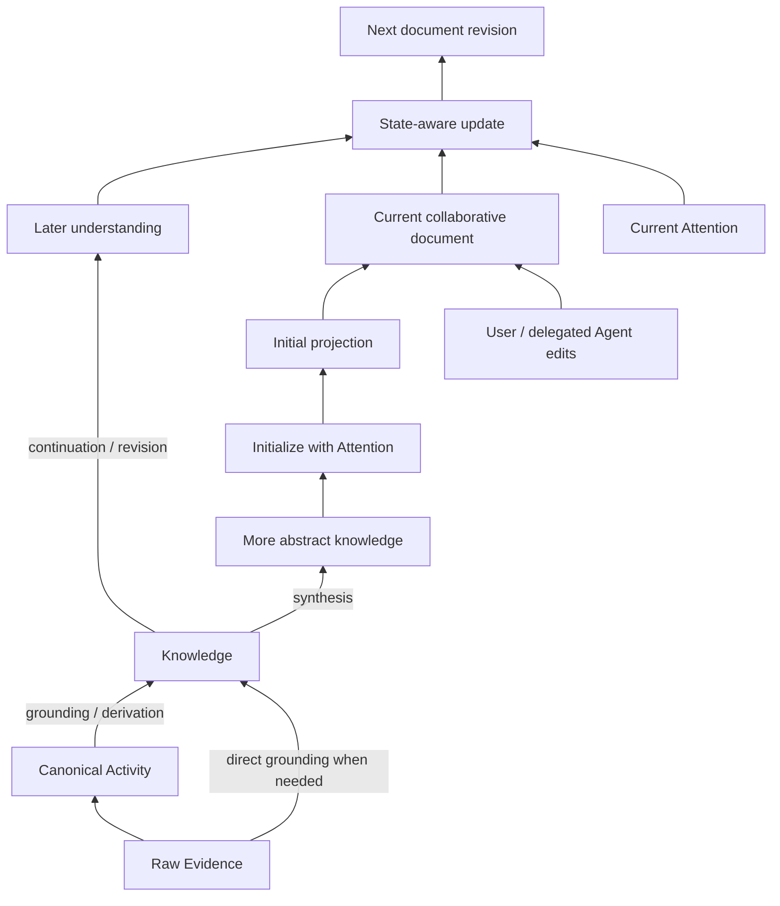

# 知识模型与协作式投影

> 状态：早期设计原则，供后续数据模型与评测设计使用
>
> 日期：2026-07-23
>
> 范围：只讨论知识的纵向层次、层间关系、中间知识层的维护原则与用户视图；不选择数据库、索引、Embedding、具体字段或固定本体。

本文将三类内容明确分开：带链接的项目描述属于**外部证据**；由多个项目归纳出的共同点和差异属于**分析推断**；Borrow / Adapt / Reject 与最小不变量属于对 Oyster 的**设计建议**。项目方自报的效果或定位不被当作独立验证结果。

## 1. 结论摘要

Oyster 的知识库可以抽象为三个认识论层次，而不是三套固定的数据类型：

1. **观察层（发生了什么）**：保存来源事实及其可确定的活动结构。Raw Evidence 和由确定性解析得到的 Canonical Activity 都属于这一层。
2. **知识层（目前可以怎样理解）**：保存从观察或已有知识推导出的、可修订且有出处的理解。不同知识之间可以形成复杂网络，但不预设一套完备的实体和语义关系分类。
3. **投影层（在当前意图下什么重要）**：包括由知识和用户 Attention 初始化、再由用户与 Agent 共同维护的持久 Markdown 文档，也包括按需生成的临时消费视图。

这三层的控制权形成一个梯度：越靠近底层，流程越固定、来源约束越强；越靠近上层，越受用户意图、关注范围、表达粒度和任务目标控制。

中间层不应在 MVP 阶段被实现为一个预先设计好的“万能知识图谱”。系统只需要理解少量结构性关系：知识依据什么、如何延续或修订、如何参与投影。`冲突`、`因果`、`相似`、`支持`、`概括`等语义关系本身也可能是需要证据和修订的知识，不应默认成为不可质疑的系统边。

投影文档不是可以随时从下层覆盖式重建的纯派生物。首次文档可以由知识和 Attention 生成，但一旦用户或 Agent 参与编辑，当前文档及其历史就成为后续更新的必要输入。新事实到来时，系统应在当前版本上继续演化，而不是丢弃已有编辑后重新编译全文。

## 2. 三层不是三种内容分类

### 2.1 观察层：发生了什么

观察层包括两个现有子层：

- **Raw Evidence**：上游 transcript、人类指令、工具结果及来源元数据的保真副本；
- **Canonical Activity**：从原始格式确定性映射出的 Session、Message、Tool Call/Result、Artifact 和事件顺序等公共活动语义。

Canonical Activity 是为了跨 Harness 使用而生成的可重建观察，不是 LLM 对内容的解释。比如“assistant 输出了 X”是观察事实，但 X 本身不因此成为关于世界的真相；“工具返回失败”是观察事实，但失败原因仍可能只是后续推断。

观察层可以保留来源原生的顺序、调用—结果、父子分支和会话归属关系。系统不得在这里补造来源没有表达的因果关系。

### 2.2 知识层：目前可以怎样理解

知识层包含规则、LLM 或用户从观察中形成的理解，也可以包含从已有知识继续抽象出的上层理解。一条知识可以依赖多条观察，一条观察也可以支持多个不同理解，因此它天然是多对多网络，而不是树。

`Decision / Problem / Attempt / Outcome / Preference` 可以成为某个早期加工管线或 Attention 的有用视角，但不应成为 Oyster 核心本体。核心模型允许这些视角演化、并存或被完全不同的视角替代。

知识层允许：

- 同一组证据产生多个解释；
- 新理解补充、限定或修订旧理解，而不静默抹去历史；
- 某段关系在证据不足时保持为候选理解；
- 用户明确输入与模型推断具有不同权威性，但都保留来源；
- 更抽象的知识复用较低层知识，而不必每次直接回到所有原始消息重新生成。

### 2.3 投影层：协作中什么重要

投影是知识在用户 Attention 下形成的可消费表达。Attention 不是一个主题标签，而是用户对选择范围、问题方向、抽象程度、更新策略和表达形式的组合意图。

投影层需要区分两种生命周期：

- **持久协作文档**：Markdown Wiki、项目概览、决策脉络、失败经验等。它们是用户和 Agent 围绕知识协作的界面，有独立修订历史；
- **临时消费视图**：为一次查询或运行构建的 Context Packet 等。它们可以按需生成，不因此获得协作文档的持久状态。

本节后续所说的“投影文档”专指前者。它不是新的世界事实来源，也不是唯一的规范性 Wiki。同一知识集合可以同时存在多个有效投影文档。

首次创建可以抽象为：

```text
P₀ = initialize(K₀, A₀)
```

后续更新则必须抽象为：

```text
Pₙ₊₁ = evolve(Pₙ, ΔK, Aₙ)
```

其中 `Pₙ` 已经包含用户直接编辑和受用户委托的 Agent 编辑。系统不能假设 `Pₙ` 仍等于某次纯生成结果，也不能只用最新知识 `K` 和 Attention `A` 重建并覆盖它。

- **Attention 基本不变、知识增加**：以当前文档为基础形成新修订，保留已有编辑；
- **用户或 Agent 主动编辑**：编辑直接改变当前投影，成为下一次更新的起点；
- **Attention 明显改变**：可以从当前文档演化，也可以生成并列投影；是否分叉属于后续产品决策。

“用户执行了某次编辑”或“用户要求 Agent 这样编辑”本身可以在未来作为观察进入管线，但它不自动证明被写入的内容是真实知识，也不自动说明该修改应影响其他投影。如何解释编辑意图、决定其影响范围并重新进入知识加工，是后续产品问题，当前模型只要求完整保留当前文档及其修订历史。

## 3. 抽象关系模型



需要区分三类性质不同的关系：

### 3.1 来源原生关系

消息顺序、工具调用与结果、分支父子关系、所属会话等，来自观察层。它们表达来源记录的拓扑，不表达系统的语义判断。

### 3.2 系统结构关系

系统必须能够回答：

- 一个知识依据哪些观察或已有知识；
- 一个新理解如何延续、限定或修订旧理解；
- 一个投影最初使用了哪些知识和 Attention；
- 一个投影修订继承了哪个当前文档版本，并引入了哪些新知识或编辑。

这些关系支撑出处、增量更新、修订和删除，是比领域本体更稳定的结构性不变量。知识层及系统生成的投影贡献可以重算，但已经被用户或 Agent 编辑过的完整文档不能被假定为可从下层重新生成。

### 3.3 语义主张与弱关联

“A 导致 B”“两种方案冲突”“C 是 D 的抽象”“E 与 F 相似”并不都具有同样的确定性：

- 若关系需要解释世界，应把它视为一条可引用、可反驳、可修订的知识主张；
- 若关系只是帮助召回，可以保留为可重建的弱关联，不把它呈现为事实；
- 只有来源明确提供的关系，才可直接作为观察保存。

因此，图是知识可能采用的一种视图，不是领域真相本身。MVP 不需要先确定所有节点和边的类型。

## 4. 前沿与成熟开源路线

以下比较关注项目公开设计中“知识是什么、关系有什么地位、变化如何维护”，不比较数据库、部署方式或 benchmark 排名。项目自身发布的效果数字只视为项目方证据，不作为 Oyster 的效果证明。

### 4.1 Wikidata / Wikibase：受治理的陈述网络

[Wikibase 数据模型](https://www.mediawiki.org/wiki/Wikibase/DataModel)把知识的基本单位设计为关于实体的 statement，而不是简单覆盖属性。陈述可带 qualifier、reference 和粗粒度 rank；同一属性可以存在多个值，甚至保留已知错误但有历史意义的 deprecated statement。[Wikidata 的 qualifier 指南](https://www.wikidata.org/wiki/Help%3AQualifiers)也明确允许矛盾观点并存，再用范围、时间、来源与共识表达差异。

设计原则：**先把陈述及其适用范围、出处和治理状态变成一等对象，再谈“当前最佳答案”。** 它擅长可审计的公共事实治理，但依赖稳定身份、属性体系和社区规范；对 Oyster 的早期开放式 Agent 活动而言，完整照搬会过重。

### 4.2 Graphiti：带时间和出处的演化事实图

[Graphiti](https://github.com/getzep/graphiti)将原始 episode 保留为来源，把实体与事实关系作为派生层；事实拥有有效时间，在信息变化时失效而不是被删除，并允许规定式或学习式 ontology。

设计原则：**变化不是对当前状态的覆盖，而是有来源的时间化事实演进。** 这很适合动态世界和历史查询；代价是“什么算同一实体”“新信息何时使旧事实失效”会成为系统的核心判断，而且把大量理解压成实体—关系—实体仍会损失开放式叙述。

### 4.3 KAG / OpenSPG：Schema 与逻辑约束优先

[KAG](https://github.com/OpenSPG/KAG)认为纯向量相似和开放式信息抽取不足以支持专业领域中的数值、时间、规则和多跳推理，因此采用 schema-constrained construction、知识对齐与逻辑形式引导的检索推理；其[论文](https://arxiv.org/abs/2409.13731)强调知识图与原始 chunk 的双向索引。

设计原则：**当领域语义和推理规则足够稳定时，用显式 Schema 降低歧义和噪声。** 它适合专业知识服务，却把大量设计权前置给领域建模者。Oyster 目前没有稳定查询集和领域边界，不应过早采用这一路线作为通用内核。

### 4.4 Mem0：面向召回的紧凑事实记忆

[Mem0 2026 状态报告](https://mem0.ai/blog/state-of-ai-agent-memory-2026)描述的当前路线采用单次、追加式事实提取，并把语义、关键词和实体信号融合用于检索；新版用实体链接替代了可遍历的外部图接口。它还用 user、agent、session/run、app/org 等 scope 控制记忆归属。

设计原则：**只保留足以改善未来召回的紧凑事实和身份范围，不为“拥有知识图”承担额外复杂度。** 这说明关系不一定需要成为可查询图；但若只保存提取后的记忆，难以满足 Oyster 对原始证据、解释链和多种投影的要求。

### 4.5 A-MEM：由 Agent 演化的联想笔记网络

[A-MEM](https://github.com/agiresearch/A-mem)借鉴 Zettelkasten：新记忆被写成带上下文、关键词和标签的笔记，系统寻找历史关联、建立链接，并可能更新既有记忆的上下文表示。

设计原则：**关系可以从使用和相似性中逐步涌现，不必先有全局 ontology。** 它为开放式个人知识提供了灵活性；但自动生成链接以及回写旧笔记会降低审计性，弱关联也容易被误读为事实关系。

### 4.6 Hindsight：观察、经验与反思分离

[Hindsight](https://github.com/vectorize-io/hindsight)把记忆分为 world facts、experiences 和由 reflect 形成的 mental models，并把 retain、recall、reflect 分为不同动作。反思可以从已有记忆形成新连接和洞见，而不是把所有输入直接放在同一平面。

设计原则：**原始记忆与反思性理解应有不同地位，抽象知识需要显式形成过程。** 这与 Oyster 的观察—知识分层接近；但 world/experience/mental model 是一套较强的认知先验，应作为启发而不是核心分类。

### 4.7 GraphRAG：为全局理解预计算层级摘要

[Microsoft GraphRAG](https://microsoft.github.io/graphrag/index/methods/)从文本单元提取实体、关系和可选 claims，再形成社区及多粒度报告；其[论文](https://arxiv.org/abs/2404.16130)把这一层级索引用于回答传统局部 RAG 难以处理的全局问题。

设计原则：**中间关系网络的一个重要价值，是支撑更高层的全局综合，而不只是逐块召回。** 但社区报告是面向一类查询预先生成的有损摘要，且更适合相对静态语料。对持续到来的 Agent 活动，它更适合作为可重算的生成基线或索引，而不是唯一知识真相或对协作文档的覆盖源。

### 4.8 Living Wiki / OpenWiki：用户目标驱动的可读投影

[OpenWiki Brains](https://www.langchain.com/blog/introducing-openwiki-brains-general-purpose-wiki-memory-for-agents)允许用户通过提示定义系统应关注的内容，再把多来源信息维护成 Markdown Wiki；[OpenWiki 的 OKF 支持](https://www.langchain.com/blog/openwiki-0-2-adds-okf-support)增加最小元数据、目录索引和变更日志。

[The Living Wiki](https://openreview.net/attachment?id=e64EcfHp8L&name=pdf)进一步把 immutable sources、agent-owned wiki 和 human-configured schema 分开。其实验同时给出一个重要反例：Wiki 能提高部分来源命中与实体聚合，但综合答案未必优于 RAG，持续重写还会产生断链。这说明**可读 Wiki 是有价值的高层界面，却不能替代证据和中间知识；自动维护也不能假定重写永远优于保留现状。**

## 5. 共同取舍

这些路线虽然目标不同，仍出现了几个共同方向：

1. **来源与理解逐渐分离。** Graphiti 保留 episode，KAG/GraphRAG 连接原文块，Wikibase 为陈述保存 reference，Living Wiki 保留 immutable sources。只保存摘要会失去重建和纠错能力。
2. **单一“当前真相”不足以表达变化。** Wikibase 允许多陈述和 rank，Graphiti 使旧事实失效但保留历史，反思式系统把新理解作为演化结果。
3. **身份、时间、范围与出处比丰富类型更基础。** 即使 Mem0 放弃可查询图，也保留实体链接和多级 scope；动态图系统则把时间和来源放进核心。
4. **关系服务于不同目的。** 有些关系是待治理的事实，有些是推理约束，有些只是检索信号，有些用于形成层级摘要。把它们统一解释成“已知事实边”会产生错误确定性。
5. **高层表达必然有损且与目标相关。** GraphRAG 社区报告、Hindsight mental model 和 Wiki 页面都在压缩底层信息；一旦用户参与编辑，高层表达还会包含下层知识无法完全重建的用户判断。
6. **维护是持续过程，不是一次抽取。** 代表性路线分别选择追加、失效、反思、重连、重写或重建；差别在于谁有权改变旧知识，以及是否保留变化链。

没有一个项目同时解决异构原始证据保真、开放式关系、时间演化、用户 Attention 投影和跨 Harness 供给。Oyster 不应通过组合所有功能来弥补这一点，而应只保留与自身定位一致的不变量。

## 6. 关键设计差异

| 路线 | 知识基本单位 | 关系的地位 | 变化策略 | 主要权威来源 | 核心取舍 |
| --- | --- | --- | --- | --- | --- |
| Wikibase | 带范围与引用的陈述 | 受 Schema 治理的主张 | 多值并存、rank、deprecated | 社区与引用 | 审计性强，建模与治理成本高 |
| Graphiti | 有时间窗口的事实关系 | 世界状态主张 | 增量加入、旧事实失效但保留 | episode + 提取逻辑 | 动态性强，实体解析和失效判断重 |
| KAG | Schema 对齐的领域知识 | 推理约束与事实 | 受领域模型约束地更新 | 专家 Schema + 来源 | 精确推理优先，开放性较低 |
| Mem0 | 可召回的紧凑事实 | 实体/关联主要是排序信号 | 追加式积累 | 提取策略 + scope | 简洁高效，解释链较弱 |
| A-MEM | 上下文化笔记 | 涌现的联想链接 | 新增时重连并演化旧表示 | Agent 判断 | 灵活，关系可靠性与可审计性较弱 |
| Hindsight | 事实、经验、mental model | 反思形成的理解连接 | retain 与 reflect 分开 | Agent 反思 | 抽象过程清晰，认知分类先验较强 |
| GraphRAG | 实体关系与社区报告 | 综合与导航索引 | 重新索引/重建摘要 | 语料 + 提取/聚类 | 全局理解强，投影有损且偏批处理 |
| Living/OpenWiki | 页面与链接 | 可读导航、综合与协作界面 | Agent 持续 gardening | 用户 schema/attention + Agent | 使用直接，断链和覆盖人工编辑风险高 |

最根本的差异不是“用图还是向量”，而是：

- 系统把关系当作事实、解释还是召回线索；
- 新知识到来时，是覆盖旧状态、使其失效、并列保存，还是重新综合；
- Schema 由系统预设、领域专家规定、Agent 学习，还是用户在投影时表达；
- 高层摘要是知识真相、可覆盖式重算的视图，还是有自身历史的协作文档。

## 7. 对 Oyster 的取舍

### Borrow

- 借鉴 Wikibase：陈述可以并存，出处、适用范围和修订地位比强行选出唯一真相更重要；
- 借鉴 Graphiti：原始 episode 与派生事实分离，变化保留历史而不是删除旧理解；
- 借鉴 A-MEM：开放领域的关联可以逐步涌现，无需先建设完整本体；
- 借鉴 Hindsight：观察与反思性理解必须分层，知识之间可以继续形成更高层知识；
- 借鉴 GraphRAG：层级综合很有价值，但只将自动生成部分视为可重算结果；
- 借鉴 Agent Wiki：用户 Attention 应成为创建和更新可读视图的显式输入，Markdown 是适合用户与 Agent 共同维护的界面。

### Adapt

- 将 `derived-from`、`continuation/revision` 等保留为系统结构，而把因果、冲突、相似、概括等放入可修订知识或弱索引；
- Raw Evidence 与 Canonical Activity 共同构成观察层，延续现有导入架构，不额外制造一套新的底层真相；
- 允许管线使用 Decision、Problem、Attempt、Outcome 等提取视角，但把它们配置成可替换 Attention/策略，而不是全局类型；
- 正常演进以追加新知识和新投影修订为主；用户删除仍按既有策略级联清除；
- 投影记录初始 Attention、知识依赖和文档修订历史；后续更新必须读取当前文档，并可并列维护其他关注方向的文档。

### Reject for now

- 在真实查询和语料验证前建立全局本体、复杂关系类型或图数据库依赖；
- 把 LLM 抽取的实体关系直接宣布为事实；
- 只维护一个“最新正确”的 Wiki 页面并静默覆盖历史；
- 从最新知识全量重建投影并覆盖用户或 Agent 已经编辑的当前文档；
- 让投影自动回流为知识，形成无来源的自我引用；
- 把相似度、共现或社区归属伪装成语义关系；
- 将某套认知分类或文档目录结构固化为所有用户、项目和 Agent 的共同模型。

## 8. 当前最小不变量

在还不设计具体字段和技术路线时，Oyster 只需承诺：

1. 观察、知识和投影可以被清楚区分；
2. 每个知识都能追溯到观察或已有知识，派生链可以跨多层；
3. 新理解默认不静默覆写旧理解，并可表达延续或修订；
4. 多个解释和多个 Attention 投影可以同时存在；
5. 语义关系必须保留其认识论地位：来源事实、可修订主张或弱关联；
6. 持久投影文档是可编辑、持久化的协作状态；每次自动或 Agent 更新都以当前文档为输入；
7. 系统生成的贡献可以重算，但重算不得覆盖无法由下层重建的用户或 Agent 编辑；
8. 投影文档不是世界事实；编辑行为未来可以作为观察回流，但其语义和影响范围必须另行解释；
9. Attention 影响知识的选择和表达，不反向改写底层知识；
10. 正常加工遵循追加修订原则，但用户删除权始终优先。

## 9. 尚未决定与验证方式

当前刻意不决定：知识对象的具体字段、实体标签、语义关系词表、图存储、向量索引、合并算法和投影模板。

下一阶段应先用真实脱敏会话与真实查询验证：

- 用户是更常复用上层抽象，还是回查底层事实与执行细节；
- 哪些语义关系会稳定地改善理解，而不仅是让图看起来更丰富；
- “关系作为知识对象”与“关系作为固定边”在引用、修订和查询上的实际成本；
- 同一证据生成多个理解时，用户如何比较、确认或忽略它们；
- 如何在当前协作文档上吸收新知识，同时稳定保留用户和 Agent 已有编辑；
- 如何把直接编辑或编辑指令作为观察重新进入管线，并区分知识修正、Attention 变化和仅影响当前文档的选择；
- 哪些知识加工可以全自动，哪些只应作为候选，哪些需要用户主动触发。

在这些问题得到证据前，保持模型简单不是暂时妥协，而是防止错误先验进入长期数据的核心设计原则。
