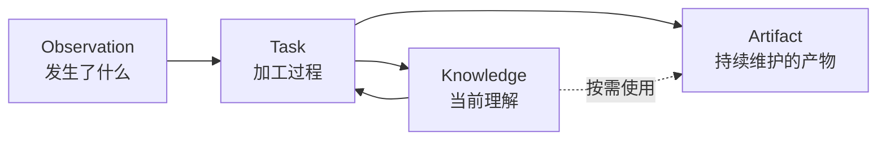

# Observation、Knowledge 与 Artifact

## 为什么要区分三种信息

Agent 活动、形成的理解和用户真正要维护的产物具有不同的修改语义：Observation 需要保真，Knowledge 需要能够修订，Artifact 需要延续用户已经接纳的状态。把三者都当成聊天、向量节点或可重建文档，会丢失出处、覆盖用户编辑，并把运行噪声固化为长期事实。

因此 Oyster 保留三种信息形态，而不是为每种形态建设隔离的系统：

Task 是改变信息的过程，不是第四种信息形态。搜索结果、局部图和工作台是由正式内容形成的界面，不建立平行真相。

## Observation

Observation 可以来自外部 Agent Conversation 或人类指令。人类指令已经确定为可选输入形态，但当前 Knowledge Processing 的结构化选择入口仍只支持 Conversation。发现阶段只保存轻量 catalog，不主动复制全部正文；用户选择一份 Conversation 后，Source Adapter 按稳定身份读取当时的当前内容，并以内容引用固定本次实际使用的版本。Task 可以将阅读所需的活动页、原始证据页和附件写入自己的 revision，使本次加工可审计。

外部文件可能移动、变化或消失。系统必须明确暴露来源失效，不能静默替换为相似记录。Catalog 元数据不是用户选择的内容版本；接受时读取到的稳定字节才通过内容引用获得不可变身份。过去使用的 Task 材料是当时加工的记录，但不会自动升级为新的外部来源。

领域设计只关心“实际读取了哪份内容”。准确的读取、变化检测和重新定位算法属于 Adapter 实现，不再创造与内容版本平行的领域身份。

## Knowledge

每个 Statement 是一份以自然语言为主的 Markdown，第一项 H1 作为当前 canonical title，wikilink 表达对其他 Statement 的显式引用。这个最小格式便于用户和 Agent 用普通文件工具维护，也让搜索、反向引用和局部图都能从正文重建。

当前名字表达内容身份，而不是隐藏的稳定 ID。这个选择降低了早期模型复杂度，但意味着重命名与引用迁移仍需后续治理。

可核查出处是 Knowledge 的核心产品承诺。当前 Observation 和 Git revision 已保留部分审计基础，但 Statement 级 provenance 的表示、核查和 UI 尚未确定；文档不把目标写成已实现保证。

## Artifact

Artifact 使用普通目录承载任意内容，并通过根 `AGENTS.md` 声明“这是一个需要由 Agent 持续维护的产物”。选择 `AGENTS.md` 是为了复用 Coding Agent 已有的上下文约定，而不是创造 Oyster 专用 manifest。它是维护该 Artifact 的说明；Agent Runtime 的 System Prompt 在信任优先级上更高。MVP 不为潜在冲突增加额外治理层。

Artifact 的当前名字和目录就是身份。目录可以包含二进制、大文件或完整工程；工作台和通用文件浏览器因此只提供尽量通用的阅读入口，不要求统一 Schema。Skill 只是 Artifact 的一种实际用途，其消费约定由对应产品设计说明。

## Repository 与协作

三种信息在一个标准 Git Repository 中协作。Knowledge 和 Artifact 是全局正式内容；Task 在独立 branch/worktree 中修改它们，并把输入与必要过程摘要放在同一历史中。Task 不保存完整 Knowledge Snapshot，任何时刻的内容都通过 Git revision 读取。

当前架构有意采用高信任 Agent：普通文件、Shell 和 Git 足以表达维护行为，Agent Runtime 不增加内容路由器、文件类型白名单或复杂审批协议。文档型 Review 反馈适合原地写入，其他内容可以把反馈写入 `PROGRESS.md` 等统一位置。没有留下待处理反馈的 Reviewer 可以继续完成 Repository 集成；这是刻意采用的最小自然语言协议。

当前存储与浏览采用同步文件扫描等简单实现。这是早期规模取舍；只有真实数据证明延迟、内存或写放大不可接受时，才引入索引、分页或增量存储。

## 未确定方向

- Chat Agent 是否迁移到独立 worktree，并由 Agent 负责 merge/rebase；
- Statement 重命名、合并、拆分与 wikilink 迁移；
- provenance 的正式结构与核查体验；
- Artifact 的跨设备身份、同步和更复杂的协作治理。

这些方向不引入 Project 概念，也不改变 Observation、Knowledge 与 Artifact 的基本区别。
