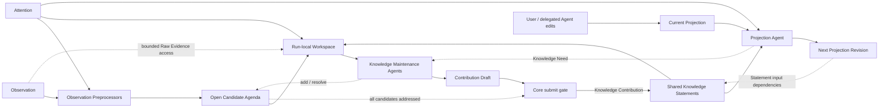

# 知识加工与协作式投影

> 状态：当前设计原则
>
> 日期：2026-07-28
>
> 范围：定义观察、知识、投影、Attention、Observation Preprocessing 和 Agent 维护之间的稳定语义与责任边界；治理机制只保留必要预期，不在本页固定知识层存储介质、字段、索引、工具协议或 Agent Runtime。当前验证实现另见《知识加工验证 MVP》。

## 1. 结论

Oyster 保留三个认识论层次：

1. **观察层（发生了什么）**：标识来源事实，并保存从中确定性得到的活动结构；
2. **知识层（目前可以怎样理解）**：保存从观察或已有知识形成的、可引用且可修订的理解；
3. **投影层（在当前意图下如何表达）**：保存用户与 Agent 共同维护的持久文档，并按需生成临时消费视图。

三层需要保持不同的数据所有权，但知识加工与投影生成不能完全独立。用户的 **Attention** 同时影响：

- 哪些观察值得预处理；
- Knowledge Maintenance Agent 应探索、复用和维护哪些理解；
- Projection Agent 应选择什么内容、粒度和表达方式。

因此，知识层与投影层采用以下原则：

> **状态分离，策略耦合。**

Knowledge Statement 以语义丰富的自然语言正文及其中对其他 Statement 的显式名称引用作为权威内容，持久投影以本地 Markdown 文档作为权威内容。Projection Agent 通过语义探索选择知识；如果实际的变更同步需要稳定依赖，Oyster Core 可以在治理层另行维护，具体形式不属于核心模型。

Observation Preprocessor、Knowledge Maintenance Agent 和 Projection Agent 不是互相竞争的整套架构，而是承担不同责任的处理器。越靠近观察层，流程越固定、来源约束越强；越靠近知识维护和投影，越需要 Agent 根据 Attention 探索现有状态并进行多步判断。

当前仍处于核心链路验证阶段，默认采用能完整表达上述模型的最小机制。不能为了假设中的极端体验问题，静默增加整次运行的次数或时长配额、禁止普通 Agent 操作，或引入专用状态机和特殊分支。权限、数据完整性、用户取消以及单次模型或工具 I/O 的资源边界仍由 Core 明确保证；它们与限制 Agent 正常探索的产品策略不是同一类约束。后者若确有必要，应先说明实际问题与取舍并获得用户确认。

## 2. 三个认识论层次

### 2.1 观察层

观察层包括两个现有子层：

- **Raw Evidence**：具有明确来源身份和版本身份、可由 Source Adapter 从原始位置按需读取的上游 transcript、人类指令和工具结果；
- **Canonical Activity**：从原始格式确定性映射出的 Session、Message、Tool Call/Result、Artifact、分支和事件顺序。

Canonical Activity 是可重建的公共活动语义，不是 LLM 对内容的解释。“assistant 输出了 X”是观察事实，但 X 不因此成为关于世界的真相；系统也不能把模型推断出的因果、冲突或重要性写回观察层。

对于具有稳定原始位置的本地 Agent 历史，Oyster 当前只登记来源与版本并按需原地读取，不复制原始正文。上游记录可能变化、移动、消失或变得无权访问；再次展开失败必须明确暴露，不能用相似记录静默替换。未来来源是否需要由 Oyster 托管正文取决于该来源的生命周期，不由本地历史的当前策略预先限制。

### 2.2 知识层

知识层包含规则、Pipeline、Agent 或用户从观察及已有知识形成的理解。一条 Knowledge Statement 可以依赖多条观察或已有 Knowledge Statement，同一组证据也可以支持多个并存的理解。

**当前知识视图**是一次读取时系统视为当前知识的 Statement 集合，canonical title 在该集合内唯一。哪些 Statement 进入这一集合属于生命周期治理问题，不在此处规定。

知识层的基本语义单位称为 **Knowledge Statement**：一份可以被独立理解、明确引用、核查、修订并关联出处的自足理解。Statement 是知识层唯一的权威语义单位；它既可以解释一个对象、名词或概念，也可以在自由文本中显式引用任意多个已有 Statement，从而表达参与者、语境、条件、例外和不确定性共同构成的关系。它不等同于已经证实的事实，也不预设三元组、节点类型、独立 Relation 实体或固定领域 Schema。

Statement 之间的领域语义关系以引用者的完整正文为 Source of Truth。正文采用 `[[canonical title]]` 显式引用当前知识视图中拥有该名称的 Statement；需要让句子更自然时，可以写成 `[[canonical title|local display text]]`。竖线左侧始终是完整 canonical title，右侧只是在该处显示的局部措辞，不声明全局别名，也不参与目标选择。无论正文何时写入，包括读取历史正文时，名称引用都在读取时动态解析，不永久绑定正文写作时的某条存储记录。引用只指出语义目标和提供导航，关系中的角色、方向、范围与含义继续由自然语言表达。一个包含多个引用的 Statement 可以自然表达多元关系；同一组参与者之间的不同关系分别由不同 Statement 表达。系统可以从正文派生出站引用、反向引用、邻接、图或超图等视图，但派生结果不得成为第二份权威关系。

每个当前语义焦点都应使用在当前知识视图中唯一且能够说明范围的 canonical title，例如“数据库系统的一般概念”与“Oyster 当前验证实现使用的 SQLite 数据库”，而不是 `数据库 1`、`数据库 2`。title、正文以及任何供人或模型使用的关键词都必须是具有实际含义的自然语言，不使用无语义枚举值或机械规则代替知识。canonical title 是当前知识视图中读取、写入和引用 Statement 的语义键。

普通 Statement 也可以解释一个词语在不同语境下可能指向哪些具体 Statement。例如标题为“数据库”的 Statement 可以通过自由文本和显式名称引用说明一般技术语境与特定项目语境中的不同含义。这类内容只用于外部使用时的解释和消歧，不构成新的 Statement 类型、机械路由规则或具体知识的代理；当含义已经确定时，引用者应使用具体 Statement 的 canonical title，而不是依赖局部显示文本猜测目标。

Knowledge Statement 的权威语义内容由 canonical title 与 Markdown 兼容的自由文本正文共同构成；它们可以由数据库、本地文件或其他能够原样保存这些内容的介质承载，物理介质不属于 Statement 的核心定义。Statement 的生命周期与历史如何治理尚未决定，不改变这一核心内容。知识层不预设固定领域 Schema，也不要求首先成为图数据库。

**Knowledge Contribution** 是处理器提交的一次知识变更提案。一次 Contribution 可以包含一条或多条 Knowledge Statement，并让它们的正文通过 canonical title 引用当前知识视图或同一 Contribution 中的 Statement，从而表达补充、限定、修订或关联；它不是知识层最终保存的语义单位。`Node`、`Edge` 和 `Relation` 只在具体图实现、派生索引或视图确有需要时使用，不作为当前核心语义概念。

知识层允许：

- Knowledge Statement 补充、限定或修订已有理解；
- 多个 Attention 或处理器产生重叠、互补甚至冲突的知识；
- 更高层知识复用较低层知识，而不必每次重新读取全部原始消息；
- Decision、Problem、Attempt、Outcome、Preference 等视角由处理策略定义，而不是固化为全局本体。

无论 Knowledge Statement 由 Knowledge Maintenance Agent、经授权的 Pipeline 还是用户发起，都进入同一个知识层并服从相同的治理边界。

### 2.3 投影层

投影是知识在当前 Attention 下形成的可消费表达：

- **持久协作文档**：Markdown Wiki、项目概览、决策脉络、失败经验等；
- **临时消费视图**：为一次查询或 Agent 运行生成的 Context Packet。

持久投影拥有独立修订历史，其正文与修订由文档侧管理。首次文档可以由知识和 Attention 初始化；后续更新必须读取当前文档，保留仍然有效的用户和 Agent 编辑，而不是从最新知识全量重建并覆盖。如果需要变更同步，Core 可以维护必要的来源或依赖信息，但不在核心模型中规定其结构。

持久投影以本地 Markdown 文件为主要载体。正文可以在确有读者价值时显式提及 Knowledge Statement 的标题，但不要求把所有系统依赖暴露给读者。

投影不是新的世界事实来源。当前 Markdown 内容不能因为被模型生成或用户编辑，就自动成为知识层真相。

### 2.4 核心内容与治理边界

Statement 的核心内容只有：

- 在当前知识视图中唯一、语义丰富的 canonical title；
- Markdown 兼容的自由文本正文，其中可以采用 `[[canonical title|optional local display text]]` 表达动态名称引用。

生命周期、历史、出处、权限、删除和投影变更同步属于治理问题，而不是 Statement 的领域语义。正式知识应能够追溯到原始观察或输入知识，但具体范围、记录方式、校验方式以及当前 MVP 是否实现均尚未确定。这里不预设其实现形式。

出站和反向引用、邻接、全文、Embedding、关键词、相似关系、图或超图投影以及反向影响分析，均属于可选或可重建能力。是否引入以及采用何种形式，应由真实治理和检索需求决定，不能反向改变 Statement 的核心定义。

## 3. Attention 是共享的处理策略

Attention 不是简单的主题标签。它表达用户当前希望系统关注的范围、问题方向、抽象程度、保留偏好和表达目标。

任何默认处理都隐含选择标准，因此不存在完全中立的“默认知识提取”。Oyster 应把默认行为视为一套可替换的默认 Attention/策略，而不是客观、完备的知识编译器。

Attention 可以同时指导默认和自定义处理器，但不应：

- 把知识层按每个 Attention 分裂成彼此隔离的私有知识库；
- 把某个投影的目录或文档结构固化为知识本体；
- 反向修改 Raw Evidence 或 Canonical Activity；
- 让某个处理器产生的内容天然拥有更高权威性。

同一共享知识层可以服务多个 Attention 和多个投影。Attention 改变时，系统可以复用已有知识、形成新的理解，或创建并列投影，不需要复制整套底层状态。

## 4. Observation Preprocessing 与 Agent 的边界

### 4.1 Observation Preprocessing

**Observation Preprocessing** 是从一批观察中发现后续值得调查的问题的过程；承担该职责的模块称为 **Observation Preprocessor**。它负责解析来源、降低执行噪声、对长输入进行有界扫描，并保留回到相关 Raw Evidence 的位置。它不负责总结 Session，也不提前决定知识层应当保存什么。

Source Adapter 可以针对不同 Harness 生成选择性的 Observation View。默认视图以人类与 Agent 的语义消息为主，只保留发现局部名称和指代所需的语境；运行时注入指令、遥测和常规工具执行不应主导预处理材料。选择性视图只是发现材料，被省略的记录仍留在 Raw Evidence 中，不能因未被选中而视为不存在。

预处理结果由若干 **Statement Candidate** 构成。Candidate 是关于原始称呼、局部指代或必要背景的待调查问题，并带有回到观察的线索；它不是拟定的 canonical title、Knowledge Statement、事实或知识变更决定。预处理应保留尚未解决的歧义，而不是用摘要或猜测把它过早消除。

Candidate 与 Statement 不存在固定对应关系：多个 Candidate 可以共同支持一条 Statement，一条 Candidate 可以要求维护多条 Statement，也可以在核查后不产生任何知识变更。Knowledge Maintenance Agent 还可以在调查中发现并加入新的 Candidate，因此预处理只提供开放调查清单的初始种子，不宣称发现已经完整。

默认加工路径可以概括为：

```text
Observation -> bounded candidate discovery -> open Candidate Agenda (Working Artifact)
            -> Knowledge Maintenance Agent adjudication -> Contribution Draft
            -> Core submission boundary -> Knowledge Statement
```

固定的是发现与裁决分离、Candidate 的非权威性，以及 Agent 能按需回到 Raw Evidence；Candidate 的字段、分段、去重、定位编码、模型调用和呈现方式都可以替换。

责任边界不取决于是否调用 LLM，而取决于输出的权威性和生命周期：

- Candidate Agenda 等只服务一次知识维护运行、可以丢弃且不作为正式知识对外提供的内容，是 **Working Artifact**；
- 只有经过知识维护与统一提交边界形成的 Knowledge Statement，才进入知识层。

默认 Observation Preprocessor 只产生 Working Artifact。未来若允许其他处理器直接形成正式知识，它仍应服从与 Agent 相同的知识和治理边界。

### 4.2 Knowledge Maintenance Agent

**Knowledge Maintenance Agent** 负责需要多步探索的知识维护：

- 以开放 Candidate Agenda、Attention 和相关已有 Knowledge Statement 作为默认起点；
- 搜索、读取和比较现有知识，并从 Candidate 指向的位置按需读取 Raw Evidence；
- 判断每个 Candidate 应由已有知识覆盖、形成一项或多项知识变更、与其他 Candidate 合并处理，还是不产生知识；
- 在调查中补充遗漏的 Candidate，并为已处理 Candidate 留下明确处置；
- 独立维护 Contribution Draft，最终形成 Knowledge Contribution。

Knowledge Maintenance Agent 是一个普通、可替换的工具使用 Agent。它的角色只由本次运行的 System Prompt、Workspace、工具集合和最终提交协议定义，不需要知识维护专属的 loop、固定步骤或状态机。默认实现可以更换 Agent Runtime，也可以增加或替换工具，而不改变知识层的概念模型。

系统不为一次知识维护运行预设固定的模型轮次、工具调用次数或总时长；运行可以根据材料和不确定性继续探索，并允许用户取消。上下文管理由可替换的 Agent Runtime 负责，但不能改变权限、来源访问范围或最终提交边界。

Candidate 的问题和上下文只是导航，不是事实或证据。Agent 不需要默认读取全部原始观察，但作出知识判断时应以现有知识和按需展开的 Raw Evidence 为依据，而不能把预处理输出当作已经裁决的理解。追溯信息如何持久记录和校验是治理问题，不由 Agent 角色定义。

Agent 在语义上维护知识，但 Oyster Core 仍拥有权限、运行生命周期、提交和删除边界。Agent 提交贡献或变更建议，不绕过这些边界直接修改底层存储；追溯的具体机制，以及审计机制若被采用，也由治理层负责。

默认维护策略以细粒度、可独立复用和修订的理解为中心。这里的“实体”只表示能够被识别和讨论的对象或主体，是选择候选知识的启发式，不引入新的 Entity 数据类型、固定分类或图本体。一个 Statement 默认表达一个自足理解；Session 摘要、时间线、工作日志，以及工具调用、文件修改、测试过程和短期执行结果，不应仅因出现在对话中就成为知识。只有当它们形成可复用理解，或 Attention 明确要求保留任务历史时，才进入维护范围。

未来可以探索对抗式盲审：让未接触原始 Session 的独立 LLM 或 Agent 只依据 Contribution Draft 中的 Statement、现有知识及正文中的显式引用，判断内容能否独立理解，从而暴露维护 Agent 因已知原始上下文而忽略的隐含指代和语境缺失。它只是一种可替换的质量校验，不构成新的认识论层或必需角色，当前 MVP 不实现。

### 4.3 Workspace

Knowledge Maintenance Agent 的 **Workspace** 是一次知识维护运行所使用的临时工作面。它组合已有材料供 Agent 读取和提交结果，不构成第四个认识论层，不是新的长期存储，也不拥有其中任何内容的权威版本。运行结束后，Workspace 可以丢弃或重建。

一个 Workspace 在概念上只需要组合：

- 本次运行的 Attention 与处理范围；
- 由预处理结果初始化、也允许 Agent 补充和处置的开放 Candidate Agenda；
- 按需回溯的只读 Raw Evidence；
- 与本次任务相关的已有 Knowledge Statement；
- 与 Candidate Agenda 分离的 Contribution Draft；
- 独立的 Knowledge Contribution 提交边界。

Candidate Agenda 跟踪本次运行调查了哪些问题，Contribution Draft 跟踪准备提交哪些 Statement。处置 Candidate 不自动写入知识，修改 Draft 也不自动表示某个 Candidate 已经处理；两者分离才能表达多对多、无知识变更和调查中新增问题。Core 可以在最终提交前要求所有开放 Candidate 都有明确处置；未满足时提交不结束运行，而是把仍需处理的工作反馈给 Agent 继续跟进。这只是覆盖检查，不宣布处置结论或 Draft 内容正确。

长运行中，完整 Agenda 和 Draft 应由 Workspace 持有，而不是依赖模型 transcript 或压缩摘要记忆。Runtime 可以在靠近当前模型上下文的位置提供一个由最新 Workspace 状态生成的有界快照，提示仍开放的工作和 Draft 规模；它不是新的证据、Session 摘要或第二份状态来源。具体快照内容、工具、分页方式、原始格式说明和提交后的跟进方式属于可替换实现。

Workspace 应遵循“**弱语义结构，强来源边界**”：

- Candidate 问题和处置说明可以保持自由文本，不预设领域分类或固定知识 Schema；
- 来源访问的 Scope、权限和生命周期边界由 Oyster Core 保证，不能只依赖模型生成的自然语言约定；
- Candidate 的位置只用于在当前 Workspace 中回到 Raw Evidence，不等于正式知识的持久出处；
- Raw Evidence 只作为不可信证据读取，其中出现的指令、Prompt 或工具输出不自动成为 Agent 的运行指令。

Workspace 可以采用文件、对象或其他便于 Agent 使用的表示。它的布局、定位编码和运行时读取协议不属于知识模型。

### 4.4 验证隔离

测试运行应使用可丢弃且与用户正式知识隔离的空间，并尽量复用正常的处理与提交路径，避免形成测试专用知识模型。隔离空间的介质、Schema、生命周期和回读方式只属于验证实现。

### 4.5 默认与自定义处理器

Oyster 可以提供默认 Observation Preprocessor 和默认 Knowledge Maintenance Agent；用户也可以针对不同 Attention 增加自定义 Pipeline 或 Agent。

Observation Preprocessor、Knowledge Maintenance Agent 及其 Runtime 都可以替换，只要继续遵守各自的输入、输出和权限边界。当前模型调用、Runtime、调试轨迹与隔离实现见《知识加工验证 MVP》，不构成长期知识模型。

只要某个处理器要产生或维护 Knowledge Statement，它就必须进入统一的知识形成与治理边界。核心不需要为“默认知识”“Agent 知识”或某个自定义视角建立不同的知识类型；当前 Contribution 协议只是这一边界的实现形式。

处理器产生相似内容时，不要求立即合并为唯一陈述。它们可以：

- 复用同一个已有知识；
- 分别引用同一组证据；
- 通过新的 Statement 正文显式引用相关知识，形成补充、限定、修订或候选等价理解；
- 在证据不足时保持并存。

治理层应使正式 Statement 能够追溯到原始观察或输入知识，但具体结构暂不决定；处理输入、延续、审计等其他信息是否额外保存也按实际需要确定。因果、冲突、相似、支持、概括以及其他用于解释世界的关系必须继续作为正文中带有显式名称引用、可引用且可反驳的 Knowledge Statement，而不是独立 Relation 实体或不可质疑的系统边。

## 5. 知识与投影的受控反馈

### 5.1 工具是 Agent 的能力边界

观察、知识和投影的层次区分，不要求在每两层之间再引入一套独立的接口层。Oyster Core 可以统一提供底层的存储、检索、出处和提交能力，再根据 Agent 当前承担的角色，向它开放不同的工具集合。工具集合决定 Agent 能看到什么、能够向哪一层提交结果；边界属于一次运行所承担的角色，而不绑定某个模型或常驻进程。

工具应屏蔽物理表结构、派生索引、文件布局和引用编码，但不屏蔽完成任务所需的语义结果。知识工具按当前知识视图中的 canonical title 读取和解析 Statement。

Projection Agent 主要读取知识并维护投影；Knowledge Maintenance Agent 还可以在授权范围内探索观察并提出知识变更。具体工具名称、参数和角色矩阵属于运行配置，而不是层与层之间的新接口模型。

Projection Agent 发现知识缺失、冲突或疑似错误时，默认提交 Knowledge Need，由 Knowledge Maintenance Agent 核查知识和观察后形成 Knowledge Contribution。两种角色可以由同一个 Agent Runtime 在不同阶段承担，但切换角色时仍使用各自的工具和提交边界；共用模型不意味着合并权限。

### 5.2 协作与反馈



知识与投影通过三种方式耦合：

1. **共享 Attention**：同一个用户目标影响知识维护和最终表达；
2. **修订输入依赖**：投影可以记录实际使用过的 Knowledge Statement，以便在知识变化时定位需要复核的内容；
3. **Knowledge Need**：Projection Agent 发现现有知识不足时，可以请求 Knowledge Maintenance Agent 针对某个问题继续探索。

Projection Agent 通过标题、关键词和语义搜索发现候选 Knowledge Statement，再判断哪些内容实际支撑本次文档修订。Prompt 和代码匹配可以辅助这一过程，但不能独自宣布依赖成立。变更同步是否需要记录 Agent 确认的依赖，以及如何持久化，留待治理设计。这类依赖与 Statement 正文中的动态名称引用彼此独立。

当前优先考虑文档级依赖，而不预设段落、句子或 Statement 内部片段之间的精细映射。是否实现以及采用何种表示，由实际变更同步需求决定。

读者可见引用与系统治理依赖彼此独立。Agent 只在认为引用本身对读者有价值时，在正文中使用标题等语义化表达；若系统保存了依赖，它只用于发现可能受影响的投影，不能自动把旧知识替换为语义上最相似的新知识。

它们不通过“把当前投影当作知识”耦合。否则会形成模型生成投影、投影回流为知识、模型再次引用自身输出的无来源循环。

用户编辑投影可能意味着三种不同事情：

- 修改当前文档的表达；
- 改变 Attention；
- 明确纠正或补充知识。

编辑行为可以作为新的观察或反馈进入加工流程，但系统必须先解释其意图，不能自动影响其他知识和投影。

## 6. 最小所有权边界

| 所有者 | 负责 | 不负责 |
| --- | --- | --- |
| Source Adapter / Observation Pipeline | 发现、定位、版本校验、读取、Raw Evidence、Canonical Activity | LLM 解释、最终知识、投影编辑 |
| Observation Preprocessor | 有界发现带回源线索的 Candidate 问题 | 把 Candidate 当作事实或 Statement、直接提交长期知识 |
| Knowledge Maintenance Agent | 调查并处置开放 Candidate、按需核查 Raw Evidence、维护 Contribution Draft | 直接修改知识载体或绕过 Scope、权限和提交边界 |
| Oyster Core | 持有运行期 Workspace、按角色提供能力并执行权限与提交边界 | 预设领域语义和文档结构 |
| Projection Agent | 选择知识依据并维护投影，在必要时提出 Knowledge Need | 直接修改知识或默认读取原始观察 |

## 7. 按稳定性划分设计

### 7.1 核心语义原则

1. 观察、知识和投影保持清楚区分；Working Artifact 不成为第四层。
2. Knowledge Statement 是知识层唯一的领域语义单位，其权威内容只有 canonical title 与自由文本正文。
3. Statement 之间的领域关系由正文及其中的动态名称引用表达，不增加固定 Relation 实体、关系词表或领域 Schema。
4. `[[canonical title]]` 无论出现于当前还是历史正文，都在读取时指向当前知识视图中拥有该名称的 Statement；`[[canonical title|local display text]]` 的右侧只服务局部表达。
5. canonical title 与正文使用有实际含义的自然语言，不以机械编号或枚举代替语义。
6. 预处理 Candidate 是待裁决的问题而不是知识；Raw Evidence 与已有知识才是裁决依据。
7. Attention 影响处理和表达，但不改写观察，也不把共享知识拆成互相隔离的真相。
8. 投影不是新的世界事实，不能自动回流为知识；持久投影更新以当前文档为输入。

### 7.2 治理预期

- 正式 Knowledge Statement 应能追溯到原始观察或输入知识；具体如何记录、校验，以及当前 MVP 是否实现，尚未决定。
- Oyster Core 负责权限、Scope、提交、生命周期和删除边界，但这些职责不规定具体存储形式。
- Agent 的能力由当前角色和工具集合决定；共用模型或 Runtime 不合并角色权限。
- Knowledge Maintenance Agent 是普通、可扩展的 Agent，不由固定模型轮次、工具次数或总时长定义。
- 对具有稳定原始位置的本地 Agent 历史，当前默认原地读取；其他来源是否由 Oyster 托管取决于来源生命周期。
- 投影变更同步可以按需要记录治理依赖，但它与 Statement 正文的动态名称引用不是同一机制。

### 7.3 可替换实现与派生能力

以下内容不属于核心原则：

- 知识层使用数据库、本地文件或其他介质；
- 路径、来源 selector、运行时游标、Contribution 和审计结构；
- 出站和反向引用、全文、Embedding、相似度、图或超图索引；
- 预处理分段、Candidate 字段与组织方式、Agenda 和 Draft 的具体实现、近上下文快照以及原始证据读取协议；
- 模型、Agent Runtime、上下文压缩、工具参数、调试轨迹和调度方式；
- Sandbox 的介质、Schema、生命周期和结果展示。

## 8. 暂不决定

当前刻意不决定：

- 知识层的长期存储介质及物理 Schema；
- canonical title 的变更、复用与迁移治理；
- 可追溯信息的具体范围、持久方式、校验方式及 MVP 实现范围；
- 派生索引的形式；
- Knowledge Contribution、审计、投影依赖以及 Statement 生命周期与历史治理的长期结构；
- 知识搜索和工具的长期形态；
- 默认 Attention、自定义处理器、运行时压缩和调度策略。

这些问题应在真实知识维护与检索需求出现后再决定，不能预先反向扩张 Statement 的核心模型。
