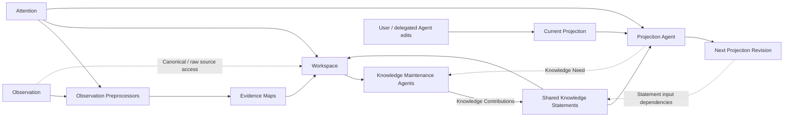

# 知识加工与协作式投影

> 状态：当前设计原则
>
> 日期：2026-07-27
>
> 范围：定义观察、知识、投影、Attention、Observation Preprocessing 和 Agent 维护之间的责任边界；确定各层的权威载体、最小持久格式与依赖原则，但不把具体数据库产品、字段物理类型、索引实现、固定本体或某个 Agent Runtime 固化为长期架构要求。当前验证实现的具体选择另见《知识加工验证 MVP》。

## 1. 结论

Oyster 保留三个认识论层次：

1. **观察层（发生了什么）**：标识来源事实，并保存从中确定性得到的活动结构；
2. **知识层（目前可以怎样理解）**：保存从观察或已有知识形成的、可引用且可修订的理解；
3. **投影层（在当前意图下如何表达）**：保存用户与 Agent 共同维护的持久文档，并按需生成临时消费视图。

三层需要保持不同的数据所有权，但知识加工与投影生成不能完全独立。用户的 **Attention** 同时影响：

- 哪些观察值得预处理；
- Knowledge Maintenance Agent 应探索、复用和维护哪些理解；
- Projection Agent 应选择什么内容、粒度和表达方式。

因此，知识层与投影层采用以下原则：

> **状态分离，策略耦合。**

Knowledge Statement 以数据库中的自由文本记录作为权威内容，持久投影以本地 Markdown 文档作为权威内容。Projection Agent 通过语义探索选择知识，Oyster Core 则在投影修订上保留已经确认的 Statement 依赖。

Observation Preprocessor、Knowledge Maintenance Agent 和 Projection Agent 不是互相竞争的整套架构，而是承担不同责任的处理器。越靠近观察层，流程越固定、来源约束越强；越靠近知识维护和投影，越需要 Agent 根据 Attention 探索现有状态并进行多步判断。

## 2. 三个认识论层次

### 2.1 观察层

观察层包括两个现有子层：

- **Raw Evidence**：具有明确来源身份和版本身份、可由 Source Adapter 从原始位置按需读取的上游 transcript、人类指令和工具结果；
- **Canonical Activity**：从原始格式确定性映射出的 Session、Message、Tool Call/Result、Artifact、分支和事件顺序。

Canonical Activity 是可重建的公共活动语义，不是 LLM 对内容的解释。“assistant 输出了 X”是观察事实，但 X 不因此成为关于世界的真相；系统也不能把模型推断出的因果、冲突或重要性写回观察层。

对于本地外部 Agent 历史，Oyster 只持久化来源身份、内部 locator 和版本指纹，不复制原始正文。来源版本在被使用时确定；正式加工与测试均由同一个 Source Adapter 原地读取。上游记录可能变化、移动、消失或变得无权访问，因此 Raw Evidence 的身份可以长期保留，而正文的可用性不作永久保证。来源失效后，已有知识仍保留当时的出处身份；再次展开失败必须明确暴露，不能用相似记录静默替换。这里不要求额外持久化一份记录级“可用状态”。

### 2.2 知识层

知识层包含规则、Pipeline、Agent 或用户从观察及已有知识形成的理解。一条 Knowledge Statement 可以依赖多条观察或已有 Knowledge Statement，同一组证据也可以支持多个并存的理解。

知识层的基本语义单位称为 **Knowledge Statement**：一份可以被独立引用、核查、修订并关联出处的自足理解。它不等同于已经证实的事实，也不预设三元组、节点类型或固定领域 Schema。

Knowledge Statement 的权威内容以普通数据库中的自由文本记录保存。每条记录本身就是一个不可变的确定版本：提交后的标题和正文不原地修改，任何变化都创建新的 Knowledge Statement，并通过 `revises` 指向旧 Statement。数据库因此不需要额外的 Statement Revision 模型。它只需管理稳定身份、少量生命周期信息和必要的系统结构关系，不要求 Statement 采用固定领域 Schema，也不要求知识层首先成为图数据库。全文、向量及用于检索的语义关联或图索引可以派生重建；出处、派生和修订等影响完整性的关系仍由 Oyster Core 明确维护。

**Knowledge Contribution** 是处理器提交的一次知识变更提案。一次 Contribution 可以通过创建新的 Knowledge Statement 及其结构关系，表达补充、限定、修订或关联；它不是知识层最终保存的语义单位。`Node` 只在具体图实现或视图确有需要时使用，不作为当前核心概念。

知识层允许：

- 新的 Knowledge Statement 补充、限定或修订旧理解，而不静默覆盖历史；
- 多个 Attention 或处理器产生重叠、互补甚至冲突的知识；
- 更高层知识复用较低层知识，而不必每次重新读取全部原始消息；
- Decision、Problem、Attempt、Outcome、Preference 等视角由处理策略定义，而不是固化为全局本体。

无论 Knowledge Statement 由 Knowledge Maintenance Agent、经授权的 Pipeline 还是用户发起，都进入同一个知识层并服从相同的出处、权限、修订和删除规则。

“使用同一个模型”不等于擦除差异。系统仍需知道某个知识由哪个处理器、在什么 Attention 下、依据哪些输入形成，以便解释重叠、重新加工和级联删除。

### 2.3 投影层

投影是知识在当前 Attention 下形成的可消费表达：

- **持久协作文档**：Markdown Wiki、项目概览、决策脉络、失败经验等；
- **临时消费视图**：为一次查询或 Agent 运行生成的 Context Packet。

持久投影拥有独立修订历史。当前和历史正文由文档侧的版本机制保存，知识数据库只记录修订身份、来源和依赖。首次文档可以由知识和 Attention 初始化；后续更新必须读取当前文档，保留仍然有效的用户和 Agent 编辑，而不是从最新知识全量重建并覆盖。

持久投影以本地 Markdown 文件为主要载体。正文可以在确有读者价值时显式提及 Knowledge Statement 的标题，但不要求把所有系统依赖暴露给读者，标题也不承担稳定身份职责。

投影不是新的世界事实来源。当前 Markdown 内容不能因为被模型生成或用户编辑，就自动成为知识层真相。

### 2.4 最小持久格式

知识层只保留三类权威记录：

| 记录 | 最小字段 | 作用 |
| --- | --- | --- |
| Knowledge Statement | `id`、`title`、`content`、`origin_ref`、`created_at` | 保存一个不可变的自由文本理解；`origin_ref` 指向创建它的 Knowledge Contribution |
| Statement Relation | `source_statement_id`、`relation`、`target_statement_id` | 保存 Statement 之间必要的结构关系；初期只使用 `derived_from` 和 `revises` |
| Statement Source | `statement_id`、`source_ref`、`selector` | 指向特定版本的观察来源及其中可选的局部范围 |

`title` 是可读标签而不是唯一身份，`content` 是 Markdown 兼容的自由文本。权威关系不嵌入正文；`derived_from` 表示当前 Statement 基于另一条 Statement 形成，`revises` 固定采用“新 Statement 指向旧 Statement”的方向。一条旧知识被拆分为多条，或多条旧知识被合并为一条，都通过多条 `revises` 关系表达。

`selector` 是持久出处的一部分，用于标识一份确定来源中的稳定证据范围；它不是 Agent 分页读取原文时使用的游标。运行时读取位置只服务于一次 Workspace 中的渐进展开，不随 Knowledge Statement 持久化。两者分开后，读取工具可以调整窗口大小或继续位置，而不会改变知识已经记录的出处语义。

投影正文继续只保存在 Markdown 文件中，数据库不复制文档内容。Core 只保留三类元信息：

| 记录 | 最小字段 | 作用 |
| --- | --- | --- |
| Projection Document | `id`、`path` | 将稳定文档身份与可变文件位置分离 |
| Projection Revision | `id`、`projection_id`、`content_ref`、`origin_ref`、`created_at` | 指向一份由文档版本机制保存的确定 Markdown 修订，并记录其产生来源 |
| Projection Dependency | `projection_revision_id`、`statement_id` | 记录该文档修订实际依赖的完整 Knowledge Statement |

Statement 到投影的反向影响关系、全文、Embedding、关键词和相似关系都由以上权威记录派生，不进入最小持久格式。第一阶段也不增加知识类型、标签、置信度、重要度、状态或独立版本字段。

## 3. Attention 是共享的处理策略

Attention 不是简单的主题标签。它表达用户当前希望系统关注的范围、问题方向、抽象程度、保留偏好和表达目标。

任何默认处理都隐含选择标准，因此不存在完全中立的“默认知识提取”。Oyster 应把默认行为视为一套可替换的默认 Attention/策略，而不是客观、完备的知识编译器。

Attention 可以同时指导默认和自定义处理器，但不应：

- 把知识层按每个 Attention 分裂成彼此隔离的私有知识库；
- 把某个投影的目录或文档结构固化为知识本体；
- 反向修改 Raw Evidence 或 Canonical Activity；
- 让某个处理器产生的内容天然拥有更高权威性。

同一共享知识层可以服务多个 Attention 和多个投影。Attention 改变时，系统可以复用已有知识、形成新的理解，或创建并列投影，不需要复制整套底层状态。

## 4. Observation Preprocessing 与 Agent 的边界

### 4.1 Observation Preprocessing

**Observation Preprocessing** 是将一批观察转化为后续知识维护工作材料的过程；承担该职责的模块称为 **Observation Preprocessor**。它负责降低后续 Agent 的噪声和成本。适合在这一过程完成的工作包括：

- 格式解析、规范化、排序、分段和范围裁剪；
- Secret/PII 检测与 Redaction；
- 全文索引、Embedding 和其他可重建检索信号；
- 对局部历史进行有界摘要，并提取主题、实体、概念及其含义、约束和关系等候选；
- 保存版本、输入依赖、失败状态和可重跑结果。

这里的目标不是用一份摘要替代原始观察，也不是承诺 LLM 可以进行语义上的“无损压缩”。只要表示明显变短，它就必然包含选择。Oyster 保证的是系统级可追溯：Raw Evidence 保持完整来源身份，预处理材料中的每个单元保留原始 selector；模型被要求在 Evidence Map 的重要候选旁保留能够直接引导运行时读取的原始行号，并在材料来自超长单行的局部窗口时同时保留行内位置。只要该外部来源版本仍可访问，后续 Agent 就可以从这些位置按需展开到最小必要的原始消息或工具结果。来源不可用时，系统保留这一事实和出处身份，而不是假装仍能回源。

Source Adapter 在发送给 Observation Preprocessor 前生成一份确定性的、选择性的 Observation View。它保留对话主线、明确的人类要求，以及工具或 Subagent 的必要动作与结果索引；运行时基础提示词、工具 Schema、权限与 token 遥测、重复事件和低层执行轨迹不默认进入预处理模型。较大的工具结果可以只提供有界表示和原始 locator，完整内容仍留在 Raw Evidence 中供 Knowledge Maintenance Agent 按需读取。Adapter 负责把不同 Harness 的存储方式映射到统一的位置能力，但不把原文改写成统一语义格式。这里的选择只改变模型工作材料，不修改、删除或另存原始来源，也不新增一个认识论层。

Observation Preprocessing 可以在同一份确定来源内进行一次或多次有界直接 Model 调用。短视图默认一次完成；长视图按其中的原始顺序划分材料，每段始终引用同一个 `sourceRef`，并保留一个或多个已合并的精确全局 selector。普通材料以 `L` 行号或行范围定位；一个超长物理行被分段时，以同一 `L` 行和 `Cstart:end/total` 行内窗口定位。Prompt 要求局部地图和后续导航归并保留这些原始位置，不能把它们替换为生成文本中的位置。未被选择的中间行不进入这些 selector，也不被宣称为模型已经处理的内容。每次调用独立形成局部地图，随后由预处理器提供一份有界导航。这里不采用滚动摘要：前一范围的模型输出不会取代后一范围的输入，也不会成为新的权威来源。

Evidence Map 正文保持自由文本，因此“每个语义候选都带精确位置”是模型需要遵循的语义要求，而不是 Core 通过解析正文可以证明的结构约束。Core 独立保证每个地图 Section 都附有完整来源范围和首个可靠 EvidenceLocation；即使模型遗漏某个候选旁的位置，Agent 仍能从该 Section 的机器生成边界回源。当前不为追求候选级强保证而引入固定输出 Schema。

Observation Preprocessor 默认产出 **Evidence Map**：一种有界、可丢弃、可重算的多分辨率 Working Artifact。对于长输入，它可以由有界导航和可独立读取的局部地图共同组成，仍然只是一份逻辑上的 Evidence Map。它在概念上同时提供：

- **导航性概览**：帮助 Agent 快速理解这批观察大致发生了什么、哪些区域值得继续阅读；
- **候选证据单元**：优先提出可形成持久理解的实体、概念、含义、属性、约束、区别、关系、修正、否定边界和明确偏好；任务事件只在解释这些理解或 Attention 明确需要时作为候选，而不自动宣布为知识；
- **来源与覆盖地图**：说明候选来自哪些观察、哪些内容被跳过或仍不确定，以及如何回到原始上下文核查。

Evidence Map 是“可丢弃的压缩地图”的正式名称。它描述一种工作职责，不构成第四个认识论层，也不要求固化为特定数据库类型；在系统模型中它仍属于 Working Artifact。默认加工路径可以概括为：

```text
Observation -> Observation Preprocessing -> Evidence Map (Working Artifact)
            -> Knowledge Maintenance Agent -> Knowledge Contribution -> Knowledge Statement
```

固定的是处理边界、输入输出责任和有界生命周期，而不是一套固定知识本体。Attention 可以改变本次预处理的关注重点和压缩密度，但不能让未被选中的来源身份或已有依赖从系统中静默消失；外部原文是否继续可用由上游生命周期决定。

责任边界不取决于是否调用 LLM，而取决于输出的权威性和生命周期：

- 只供下一步使用、可随时重算且不直接对外提供的结果，是 **Working Artifact**；
- 一旦摘要或要点需要成为可持久检索、引用或进一步推理的知识，它就必须通过 Knowledge Contribution 提交为 Knowledge Statement，并保留出处。

默认 Observation Preprocessor 只产生 Working Artifact。它可以在 Artifact 中提出局部候选，但不直接提交长期知识。未来如果允许某类固定 Pipeline 直接产生基础 Knowledge Contribution，该 Pipeline 就是一个正式的知识生产者，必须遵循与 Agent 相同的出处、Scope、修订、审计和删除契约。

### 4.2 Knowledge Maintenance Agent

**Knowledge Maintenance Agent** 负责需要多步探索的知识维护：

- 以新的 Evidence Map、Attention 和相关已有 Knowledge Statement 作为默认起点；
- 多次搜索、读取和比较现有知识；
- 当 Artifact 不完整、存在冲突或将导致知识修订时，回到最小原始证据核查；
- 识别可以直接复用的知识，以及需要补充、限定、修订或并列保留的理解；
- 形成新的 Knowledge Contribution，其中可以包含对一条或多条 Knowledge Statement 的维护建议。

Agent 不应把 Evidence Map 当作不可质疑的事实，也不需要默认读取全部原始观察。它从地图获得方向，再按风险和不确定性选择是否展开证据。最终 Knowledge Contribution 必须能经由 Working Artifact 或直接引用追溯到原始观察或已有 Knowledge Statement。

Agent 在语义上维护知识，但 Oyster Core 仍拥有权限、作业生命周期、出处校验、提交、审计和删除。Agent 提交贡献或变更建议，不绕过这些边界直接修改底层存储。

默认维护策略以细粒度、可独立复用和修订的理解为中心。这里的“实体”只表示能够被识别和讨论的对象或主体，是选择候选知识的启发式，不引入新的 Entity 数据类型、固定分类或图本体。一个 Statement 默认表达一个自足理解；Session 摘要、时间线、工作日志，以及工具调用、文件修改、测试过程和短期执行结果，不应仅因出现在对话中就成为知识。只有当它们形成可复用理解，或 Attention 明确要求保留任务历史时，才进入维护范围。

### 4.3 Workspace

Knowledge Maintenance Agent 的 **Workspace** 是一次知识维护运行所使用的临时工作面。它组合已有材料供 Agent 读取和提交结果，不构成第四个认识论层，不是新的长期存储，也不拥有其中任何内容的权威版本。运行结束后，Workspace 可以丢弃或重建。

一个 Workspace 在概念上只需要组合：

- 本次运行的 Attention 与处理范围；
- Evidence Map 的有界导航，以及按需展开的局部地图；
- Canonical Activity 的可读视图，以及按需回溯的只读 Raw Evidence；
- 与本次任务相关的已有 Knowledge Statement；
- 独立的 Knowledge Contribution 输出边界。

Agent 应渐进式读取这些材料：先用 Evidence Map 的有界导航判断哪些区域值得探索，再展开对应的局部地图；只有当这些工作材料缺少必要细节、存在歧义或需要核查来源特性时，才从地图给出的原始位置展开最小范围的 Raw Evidence。`read_evidence` 使用 Agent 无关的读取契约，但默认返回上游原始文本而不是语义归一化内容，因此 Agent 仍需理解当前读取片段中可见的格式。Source Adapter 负责定位、版本校验并提供确定的原始 revision，Oyster Core 的通用 Reader 负责有界分页；未来可以向 Agent 提供更充分的格式说明，但不应静默改变 `read_evidence` 的返回语义。

Workspace 应遵循“**弱语义结构，强来源边界**”：

- Evidence Map 的摘要组织、分组和语义标签可以保持自由形式，不预设领域分类或固定知识 Schema；
- 来源身份、来源版本、局部引用、Scope、权限和生命周期必须由 Oyster Core 提供并可校验，不能只依赖模型生成的自然语言约定；
- 一条持久引用至少应指出“哪一份来源、来源的哪个版本、其中哪一部分”；当前 Statement Source 使用稳定的行 selector 表达这一区域；
- 一次运行中的读取起点由 **EvidenceLocation** 表达，最小只包含原始 `line` 与该行内的 `offset`。它由 Evidence Map 提供给 Agent，只用于定位和继续读取，不成为新的持久出处；
- Raw Evidence 只作为不可信证据读取，其中出现的指令、Prompt 或工具输出不自动成为 Agent 的运行指令。

`read_evidence` 从 EvidenceLocation 开始，并由 Agent 给出本次所需的有界 `limit`。`offset` 和 `limit` 都以 UTF-16 code unit 计量，`limit` 至少为 2，以避免在代理对中间切开字符。Core 始终执行自己的输出上限；达到上限时返回实际范围、下一 EvidenceLocation 和是否结束，而不是因为一行或整份来源很大就要求 Agent 重新猜测窗口。定位信息位于工具信封中，信封内的证据正文保持原始行内容，不为方便索引而向每行注入前缀。当前 Workspace 已绑定唯一的 `sourceRef` 和 revision，因此 Agent 不需要在每次读取时重复提交来源身份。

Evidence Map 和 Canonical Activity 的可读表示可以在 Workspace 中采用文件形式。长期方向是让外部 Raw Evidence 通过上述受控范围读取按需展开，不为 Workspace 建立整份来源副本；当前验证 MVP 会在一次应用进程内保留所选 Session 的内存快照，以验证渐进式读取，但不得把它持久化为新的 Observation 副本。Reader 不设置产品级 Session 长度上限，但当前整份读取并非流式实现，实际能力仍受进程内存等运行资源约束。Oyster Core 仍管理稳定身份、版本、权限和作业状态；原始绝对路径和 Workspace 中的临时路径都不是知识或出处的永久身份。

### 4.4 Knowledge Sandbox

**Knowledge Sandbox** 是用于验证完整知识加工链路的、可丢弃的 Knowledge Store 隔离实例。它不是第四个认识论层，也不是另一套知识模型；它必须与正式知识层使用同一 Schema、校验和提交语义，只在物理存储与生命周期上隔离。

当前验证链路从一份可用外部 Session 的确定 Raw Evidence revision 开始。Oyster Core 通过 Source Adapter 从原始位置读取它，经 Observation Preprocessor 形成 Evidence Map，再由 Knowledge Maintenance Agent 提交可包含多条 Statement 的结构化 Knowledge Contribution。Core 在运行开始前绑定独立 SQLite Sandbox，在提交时校验来源与关系、原子写入整份 Contribution，并回读实际 Statement。Agent 只能使用 Core 为当前角色提供的工具，不能自行选择或切换正式库与 Sandbox。

测试写入不影响正式知识库，也不隐含 promote 或 merge。失败和取消应丢弃未完成的 Sandbox；成功结果可以显式丢弃或从同一正式库基线重新运行。Sandbox 因此只改变验证运行的存储目标，不改变 Observation、Working Artifact、Knowledge Statement 和 Projection 的边界。

### 4.5 默认与自定义处理器

Oyster 可以提供默认 Observation Preprocessor 和默认 Knowledge Maintenance Agent；用户也可以针对不同 Attention 增加自定义 Pipeline 或 Agent。

当前验证实现用一次或多次有界直接 Model 调用承担 Observation Preprocessing，并用 Pi Agent Core 承担 Knowledge Maintenance Agent 的多轮工具循环；短 Session 仍只需一次预处理调用。默认完整链路在 Knowledge Sandbox 中提交和回读结果，同时保留不提交结果的阶段调试。这是对上述职责边界的首个可替换实现，不意味着知识模型依赖 Pi，也不把预处理器升级为 Agent。

为了观察这些处理器的行为，应用可以提供可丢弃的运行轨迹，并限制每个轨迹条目携带的内容。运行轨迹只是执行诊断：它可以展示阶段、调用和工具活动，但不构成新的认识论层、知识来源或长期审计记录，也不能以暴露模型内部推理或绕过原始证据权限为代价换取可视化。

只要某个处理器要产生或维护 Knowledge Statement，它就必须使用统一的 Knowledge Contribution 契约。核心不需要为“默认知识”“Agent 知识”或某个自定义视角建立不同的知识类型。

处理器产生相似内容时，不要求立即合并为唯一陈述。它们可以：

- 复用同一个已有知识；
- 分别引用同一组证据；
- 形成补充、限定、修订或候选等价关系；
- 在证据不足时保持并存。

系统结构只需表达出处、派生、延续和修订等稳定关系。因果、冲突、相似、支持、概括等关系若需要解释世界，应当继续作为可引用、可反驳的知识，而不是不可质疑的系统边。

## 5. 知识与投影的受控反馈

### 5.1 工具是 Agent 的能力边界

观察、知识和投影的层次区分，不要求在每两层之间再引入一套独立的接口层。Oyster Core 可以统一提供底层的存储、检索、出处和提交能力，再根据 Agent 当前承担的角色，向它开放不同的工具集合。工具集合决定 Agent 能看到什么、能够向哪一层提交结果；边界属于一次运行所承担的角色，而不绑定某个模型或常驻进程。

工具应屏蔽物理表结构、索引实现、文件布局和内部关系编码，但不屏蔽完成任务所需的语义结果。Projection Agent 需要发现相关知识、读取某个不可变 Statement 的确切内容，并按需展开可能影响理解的相关知识、后续变化和来源；它不需要通过通用图查询理解 `revises` 等关系在数据库中的存储方式。Knowledge Maintenance Agent 在这些知识读取能力之外，还可以渐进式搜索观察、读取 Canonical Activity，并在必要时展开最小范围的 Raw Evidence。观察层不需要为此增加一个维护 Agent。

第一阶段的角色能力边界保持如下：

| 能力 | Projection Agent | Knowledge Maintenance Agent |
| --- | --- | --- |
| 语义发现、精确读取和上下文展开 Knowledge Statement | 可以 | 可以 |
| 按需读取获得授权的观察细节 | 默认不开放 | 可以 |
| 提交 Knowledge Need | 可以 | 不需要 |
| 提交 Knowledge Contribution | 不可以 | 可以 |
| 生成 Projection Revision | 可以 | 不可以 |
| 直接修改底层存储 | 不可以 | 不可以 |

Projection Agent 发现知识缺失、冲突或疑似错误时，默认提交 Knowledge Need，由 Knowledge Maintenance Agent 核查知识和观察后形成 Knowledge Contribution。两种角色可以由同一个 Agent Runtime 在不同阶段承担，但切换角色时仍使用各自的工具和提交边界；共用模型不意味着合并权限。

### 5.2 协作与反馈



知识与投影通过三种方式耦合：

1. **共享 Attention**：同一个用户目标影响知识维护和最终表达；
2. **修订输入依赖**：投影修订保存已经确认的 Knowledge Statement 依赖，以便在知识变化时定位需要复核的投影；
3. **Knowledge Need**：Projection Agent 发现现有知识不足时，可以请求 Knowledge Maintenance Agent 针对某个问题继续探索。

Projection Agent 通过标题、关键词和语义搜索发现候选 Knowledge Statement，再判断哪些内容实际支撑本次文档修订。Prompt 和代码匹配可以辅助这一过程，但不能独自宣布引用成立。Agent 不需要在 Markdown 中写入内部 ID；Oyster Core 将 Agent 确认的目标解析为不可变 Statement 的稳定身份，并保存到对应投影修订的元信息中。

第一阶段采用文档级依赖：以整个投影文档修订为主体，关联一条或多条完整的 Knowledge Statement；暂不建立段落、句子或 Statement 内部片段之间的精细映射。Statement 到受影响投影的反向关系可以从这些依赖派生。

读者可见引用与系统依赖彼此独立。Agent 只在认为引用本身对读者有价值时，在正文中使用标题等语义化表达；系统依赖无论是否显示，都以投影修订元信息为准。知识发生修订、拆分、合并或删除时，依赖关系用于确定受影响范围，标题和语义匹配用于帮助 Agent 重新判断，不自动把旧依赖替换为最相似的新知识。

它们不通过“把当前投影当作知识”耦合。否则会形成模型生成投影、投影回流为知识、模型再次引用自身输出的无来源循环。

用户编辑投影可能意味着三种不同事情：

- 修改当前文档的表达；
- 改变 Attention；
- 明确纠正或补充知识。

编辑行为可以作为新的观察或反馈进入加工流程，但系统必须先解释其意图，不能自动影响其他知识和投影。

## 6. 最小所有权边界

| 所有者 | 负责 | 不负责 |
| --- | --- | --- |
| Source Adapter / Observation Pipeline | 发现、定位、版本校验、按需读取、Raw Evidence、Canonical Activity | 复制外部历史、LLM 解释、最终知识、投影编辑 |
| Observation Preprocessor | 有界转换、Evidence Map，以及其中不具权威性的局部候选 | 直接提交长期知识、全局知识维护、静默覆盖旧知识 |
| Knowledge Maintenance Agent | 通过工具渐进探索知识与观察，并提出 Knowledge Contribution | 直接修改知识存储或绕过 Scope、出处和删除规则提交 |
| Oyster Core | 按角色提供能力、校验并持久化贡献、维护出处、修订历史、稳定依赖和级联删除 | 预设所有领域语义和文档结构 |
| Projection Agent | 通过只读知识工具选择依据，生成投影修订和依赖，并在必要时提出 Knowledge Need | 直接修改知识、默认读取原始观察，或用正文标题代替系统依赖 |

## 7. 当前最小不变量

1. 观察、知识和投影始终可以清楚区分；
2. Working Artifact 只是运行中间物，不伪装成观察或无需出处的知识；
3. 每个 Knowledge Statement 都能追溯到观察或已有 Knowledge Statement，并保留处理器与 Attention 信息；
4. 默认和自定义处理器产生的知识服从同一治理契约；
5. Knowledge Statement 提交后不可原地修改；任何变化都创建新 Statement 并显式关联旧版本，多个解释和 Attention 可以并存；
6. 共享知识可以被多个处理器和投影复用，不按投影复制真相；
7. Attention 影响知识选择和投影表达，但不改写观察；
8. Knowledge Maintenance Agent 可以按需到达全部获得授权的观察细节，但不默认把全部原始观察载入上下文；
9. 外部 Raw Evidence 不复制到 Oyster；来源失效后保留出处身份，并明确暴露再次展开失败；
10. Agent 对各层的可见性和提交权限由当前角色的工具集合决定，共用底层实现或模型不合并角色权限；
11. Agent 的最终提交仍由 Oyster Core 校验并写入权威载体；
12. 持久投影更新始终以当前文档为输入；
13. 投影修订保留已经确认的完整 Knowledge Statement 依赖，正文中的可读引用不取代该依赖；
14. 投影不会自动回流为知识，用户删除权始终高于追加式加工。

## 8. 暂不决定

当前刻意不决定：

- 最小字段的物理类型、约束、索引和 Contribution / 审计记录的具体结构；
- Workspace 的长期目录布局，以及除当前行 selector 和 EvidenceLocation 之外的跨来源定位方式；
- 各项能力的长期工具形态、参数、运行步数和调度方式；当前验证实现只提供最小受控工具集；
- 读者可见引用的 Markdown 语法；
- 默认 Attention 的完整内容；
- 自定义处理器的安装和权限协议；
- 知识合并、身份解析和语义关系词表；
- 全文、向量和图索引的具体实现，以及投影模板。

这些细节应在真实脱敏会话上验证 Observation Preprocessing 能减少多少噪声、Knowledge Maintenance Agent 需要怎样的探索深度、不同 Attention 会产生多少重叠知识之后再确定。
