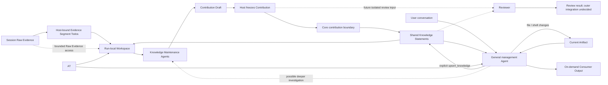

# 知识加工、Projection 与 Artifact

> 状态：当前设计原则与待议方向
>
> 日期：2026-08-01
>
> 范围：定义观察、知识、Artifact、Projection、Attention、Maintainer 和 Reviewer 之间的稳定语义与责任边界；治理机制只保留必要预期，不把当前载体提升为长期本体，也不在本页固定知识的存储介质、字段、索引、工具协议或 Agent Runtime。当前验证实现另见《知识加工验证 MVP》和《Artifact Repository MVP》。
>
> 确定性说明：第 1 节总结已确认结论，第 7.1 节列出稳定原则；第 7.2 节只是治理预期，第 7.3 节是可替换实现。第 2 至第 6 节用于解释当前边界，其中尚未决定的内容会用“可以”“如果”“未来”或“尚未决定”等措辞明确标注。第 8 节先标明已确认的 Artifact MVP 边界，再记录相关长期治理问题；其中列出的扩展方向不构成当前原则、产品承诺或实现要求。

## 1. 已确认结论

Oyster 保留三个相互区分的状态与权威域。它们不是三种固定物理存储，也不因可以采用相似的文本表示而合并：

1. **观察层（发生了什么）**：标识来源事实，并保存从中确定性得到的活动结构；
2. **知识层（目前可以怎样理解）**：保存从观察或已有知识形成的、可引用且可修订的理解；
3. **Artifact Domain（协作产物域；在当前关注下共同形成和维护什么）**：保存用户与 Agent 围绕 Attention 共同维护的持久产物。

**Projection** 是从知识、Attention 和必要的当前状态形成可消费输出，或初始化、修订 Artifact 的活动，不是第三个持久状态域本身。临时消费视图与 Artifact 之间是否存在转换关系尚未决定。

三个权威域需要保持不同的数据所有权，但知识加工、Projection 与 Artifact 维护不能完全独立。用户的 **Attention** 同时影响：

- 哪些观察值得进入知识维护；
- Knowledge Maintenance Agent 应探索、复用和维护哪些理解；
- 通用管理 Agent 应选择什么知识或 Artifact 状态，以及采用什么内容、结构、粒度和交付形式。

因此，知识层与 Artifact Domain 采用以下原则：

> **状态分离，策略耦合。**

Knowledge Statement 以语义丰富的自然语言正文及其中对其他 Statement 的显式名称引用作为权威内容；Artifact 以用户与 Agent 当前共同维护的产物状态作为权威内容。Artifact 不限定为 Markdown、文档或单一文件。它可以包含文档、配置、模板、代码、脚本、资源或它们的组合，但这些只是可能形式，不是当前固定的产物类型。通用管理 Agent 可以在同一对话中搜索和维护 Knowledge，也可以发现和修订一个或多个 Artifact；单一 Agent 身份不合并两个权威域。

Source Adapter、Knowledge Maintenance Agent 与 Reviewer 是结构化知识加工链路中边界不同的处理职责；通用管理 Agent 是面向用户、跨 Knowledge 与 Artifact 的协作界面。它们不是互相竞争的整套架构，也不要求为每种状态域建立一个长期 Agent 身份。越靠近观察层，处理越应确定、可重建；越靠近通用管理，越应让 Agent 根据对话、Attention 和当前状态自行探索并进行多步判断。

当前仍处于核心链路验证阶段，默认采用能完整表达上述模型的最小机制。不能为了假设中的极端体验问题，静默增加整次运行的次数或时长配额、禁止普通 Agent 操作，或引入专用状态机和特殊分支。当前通用管理 Agent 明确采用高信任执行模型：Harness 不按话题切换工具，不绑定 Artifact 或 Project，也不为文件和 Shell 增加路径限制、Sandbox 或逐次审批。若真实使用暴露出必须由 Harness 解决的问题，再据此讨论新的机制。

内置工具使用 Agent 可以共享 Runtime 提供的通用 Todo 与结束检查，但这两者都只是运行期控制状态。业务层可以把待处理工作投影为 initial Todo，但 Todo 不因此变成业务记录，也不替代 Contribution Draft 或任何权威域。初始 Todo 与消息输入保持独立，也不作为每轮模型上下文注入。当前具体工具和 Pi Core 接入见[《通用 Agent Runtime》](agent-runtime.md)。

## 2. 三个状态与权威域

### 2.1 观察层

观察层包括两个现有子层：

- **Raw Evidence**：具有明确来源身份和版本身份、可由 Source Adapter 从原始位置按需读取的上游 transcript、人类指令和工具结果；
- **Canonical Activity**：从原始格式确定性映射出的 Session、Message、Tool Call/Result、Activity Artifact、分支和事件顺序。Activity Artifact 是观察中记录的来源侧对象，不是 Artifact Domain 中由用户与 Agent 持续维护的 Artifact。

Canonical Activity 是可重建的公共活动语义，不是 LLM 对内容的解释。“assistant 输出了 X”是观察事实，但 X 不因此成为关于世界的真相；系统也不能把模型推断出的因果、冲突或重要性写回观察层。

对于具有稳定原始位置的本地 Agent 历史，Oyster 当前只登记来源与版本并按需原地读取，不复制原始正文。上游记录可能变化、移动、消失或变得无权访问；再次展开失败必须明确暴露，不能用相似记录静默替换。未来来源是否需要由 Oyster 托管正文取决于该来源的生命周期，不由本地历史的当前策略预先限制。

### 2.2 知识层

知识层包含规则、Pipeline、Agent 或用户从观察及已有知识形成的理解。一条 Knowledge Statement 可以依赖多条观察或已有 Knowledge Statement，同一组证据也可以支持多个并存的理解。

**当前知识视图**是一次读取时系统视为当前知识的 Statement 集合，canonical title 在该集合内唯一。哪些 Statement 进入这一集合属于生命周期治理问题，不在此处规定。

知识层的基本语义单位称为 **Knowledge Statement**：一份以可指称的主体为入口、可以被独立理解、明确引用、核查、修订并关联出处的自足理解。Statement 是知识层唯一的权威语义单位，不为主体另建 Entity 类型；它以 canonical title 指称一个对象、名词、概念或其他已经具有稳定名称的主体，并在自由文本正文中解释其含义、范围、属性、约束以及与任意多个已有 Statement 的关系。它不等同于已经证实的事实，也不预设三元组、节点类型、独立 Relation 实体或固定领域 Schema。

Statement 之间的领域语义关系以引用者的完整正文为 Source of Truth。正文采用 `[[canonical title]]` 显式引用当前知识视图中拥有该名称的 Statement；需要让句子更自然时，可以写成 `[[canonical title|local display text]]`。竖线左侧始终是完整 canonical title，右侧只是在该处显示的局部措辞，不声明全局别名，也不参与目标选择。无论正文何时写入，包括读取历史正文时，名称引用都在读取时动态解析，不永久绑定正文写作时的某条存储记录。引用只指出语义目标和提供导航，关系中的角色、方向、范围与含义继续由自然语言表达。一个主体的正文可以同时表达涉及多个 Statement 的多元关系；关系应写入它所解释的主体正文，而不是为了充当“边”而生成“X 与 Y”“X 在 Y 中的作用”之类的关系型标题。只有当某个关系或过程本身已经是具有稳定名称、可以独立指称的概念时，它才自然成为 Statement 的主体。系统可以从正文派生出站引用、反向引用、邻接、图或超图等视图，但派生结果不得成为第二份权威关系。

canonical title 负责稳定指称 Statement 的主体，而不负责概括 Statement 的结论。它通常采用原始材料中已经成立的专名、术语或能够独立指称该主体的自然名词短语，并在当前知识视图中保持唯一；正文负责说明主体所在的语境、范围、含义、属性和关系。证据中的原始表达不是拟定标题，Agent 需要先判断其中哪些词真正属于主体名称。例如当“星级”是 `北极星` 的属性时，应使用 `北极星`；项目、链路和星级含义写入正文。`ai.service-agent` 也应独立成为主体，而不是生成“dzhealth-ai-service 项目与 ai.service-agent 模块”这样的主题式标题。反过来，如果复合词本身确实是一个独立专名，则不能机械缩短。唯一性不意味着把完整语境压进标题；仅当两个不同主体确实需要消歧时，才在名词短语中加入最小且有语义的限定，例如 `Oyster SQLite 知识库`，而不是使用 `数据库 1` 或把一条命题改写成标题。canonical title 是当前知识视图中读取、写入和引用 Statement 的语义键。

普通 Statement 也可以解释一个词语在不同语境下可能指向哪些具体 Statement。例如标题为“数据库”的 Statement 可以通过自由文本和显式名称引用说明一般技术语境与特定项目语境中的不同含义。这类内容只用于外部使用时的解释和消歧，不构成新的 Statement 类型、机械路由规则或具体知识的代理；当含义已经确定时，引用者应使用具体 Statement 的 canonical title，而不是依赖局部显示文本猜测目标。

Knowledge Statement 的权威语义内容由 canonical title 与 Markdown 兼容的自由文本正文共同构成；它们可以由数据库、本地文件或其他能够原样保存这些内容的介质承载，物理介质不属于 Statement 的核心定义。Statement 的生命周期与历史如何治理尚未决定，不改变这一核心内容。知识层不预设固定领域 Schema，也不要求首先成为图数据库。

**Knowledge Contribution** 是处理器提交的一次知识变更提案。一次 Contribution 可以包含一条或多条 Knowledge Statement，并让它们的正文通过 canonical title 引用当前知识视图或同一 Contribution 中的 Statement，从而表达补充、限定、修订或关联；它不是知识层最终保存的语义单位。`Node`、`Edge` 和 `Relation` 只在具体图实现、派生索引或视图确有需要时使用，不作为当前核心语义概念。

知识层允许：

- Knowledge Statement 补充、限定或修订已有理解；
- 多个 Attention 或处理器产生重叠、互补甚至冲突的知识；
- 更高层知识复用较低层知识，而不必每次重新读取全部原始消息；
- Decision、Problem、Attempt、Outcome、Preference 等视角由处理策略定义，而不是固化为全局本体。

无论 Knowledge Statement 由 Knowledge Maintenance Agent、经授权的 Pipeline 还是用户发起，都进入同一个知识层并服从相同的治理边界。

### 2.3 Artifact Domain 与 Projection

**Artifact（协作产物）** 是用户与 Agent 围绕当前 Attention 共同形成并持续维护的持久产物。它具有独立身份、当前状态和修订生命周期，并对自身的组织、表达、交付形式及已接纳的人工编辑负责。它可以表现为文档，也可以采用能够承载目标结果的其他形式；具体格式不属于核心定义。本文将无限定词且首字母大写的 `Artifact` 专用于第三个权威域；观察中的来源侧对象称为 Activity Artifact，一次运行中的临时内容称为运行期工作材料。

Artifact 与 Attention 强相关。Attention 改变选择范围、组织方式、抽象程度、读者、用途和交付形式，因此同一共享知识可以支持多个并列 Artifact。围绕持续关注形成的 Artifact 会自然出现分组，但这种分组不得反向把共享知识划成彼此隔离的真相。是否把分组正式建模为 Project、Collection、Workspace 或其他类型尚未决定。

当前 Artifact Repository MVP 采用一项已确认但可替换的最小载体：Oyster 在 Electron `userData/artifacts/` 中维护一个固定的标准 Git Repository；Repository 中每个有效的一级目录就是一个 Artifact，其根部必须包含普通 Markdown `AGENTS.md`，用来表达该 Artifact 的持久 Attention。除具体应用明确采用的目录约定外，Artifact 内部结构保持任意。APP 直接扫描文件系统并读取当前文件，不维护数据库镜像或 manifest；当前以 Repository 相对路径作为身份。Repository 由随 APP 捆绑的私有标准 Git Runtime 创建；APP 自身发起 Git 操作时始终通过绝对可执行文件路径调用它，不依赖系统 Git 或进程 `PATH`。通用管理 Agent 的文件与 Shell 工具从该 Repository 根开始，并自行发现相关 Artifact。该载体用于验证 Artifact 的真实使用，不把“目录”“Git”或 `AGENTS.md` 变成 Artifact Domain 的长期本体。具体契约见[《Artifact Repository MVP》](../product/artifact-repository-mvp.md)。

#### Skill Artifact 的应用约定

在已确认的 Skill 管理方向中，每个由 Oyster 管理的 Skill 对应一个 Artifact。该一对一关系只是 Skill 应用对现有 Artifact 的使用约定，不增加新的权威域或核心 Artifact 类型，也不表示其他 Artifact 都是 Skill。按照当前 Repository 载体，一个 Skill Artifact 通常表现为一个目录。

Skill Artifact 的内容保持与其他 Artifact 相同的包容性。早期阶段可以默认预期 Oyster 提供和维护的 Skill 主要是承载知识与行为说明的 Markdown 文档，但这只是产品期望，不是读取、保存或管理时的硬性约束。Skill Artifact 可以包含脚本、可执行文件、配置、资源和任意其他文件；不同外部 Agent 的 Skill 格式不能因为 Oyster 当前主要使用 Markdown 而被丢弃或改写成最低公共格式。

Skill 应用对 Artifact 增加的唯一结构约定是根部直接文件系统项 `output`：其存在使 APP 把该 Artifact 识别为 Skill Artifact；`output/`、入口文档或元数据不合格时，它仍保持这一派生应用身份，但处于不可绑定状态。目标 Agent 注册位置中的目录 symlink 指向有效的 `output/`，而不是 Artifact 根。根 `AGENTS.md` 和其他维护材料继续属于 Artifact，但不进入外部 Skill 根；`output/` 内仍允许任意文件。该约定不增加 Artifact 类型、manifest 或新的权威对象；缺少 `output` 的目录仍可以是普通有效 Artifact。具体边界见[《Skill Symlink 注入 MVP》](../product/skill-symlink-injection-mvp.md)。

Artifact 页面继续呈现通用 Artifact，只为 Skill Artifact 增加派生标记、输出状态与前往 Skills 页面的入口。专门的 Skills 页面同时承载“Oyster 管理”和“外部发现”两个明确视图：前者投影 Skill Artifact 并拥有绑定工作流，后者保持外部注册关系的只读视图。两种视图可以展示同一物理内容的不同事实，但不合并身份，也不把 Skill 管理写操作放回通用 Artifact 页面。

文件被保存在或通过 `output/` 暴露，不表示 Oyster 已经决定执行、安装或信任它。外部 Agent Skill 的只读发现、显式纳管和 Skill Binding 继续保持不同；当前绑定只建立指向同一 Artifact 内容的 symlink，不提供权限隔离、格式转换、复制或双向同步。可执行内容的信任和运行治理仍是独立问题。

**Projection** 是形成消费输出的活动：

- 它可以从共享知识和 Attention 生成按需消费的输出；Context Packet 是一种可能的临时输出，而不是当前固定的第三层对象；
- 它也可以初始化 Artifact，或基于当前 Artifact、相关知识和 Attention 形成下一次修订。

Artifact 拥有独立于知识层的修订生命周期。首次 Artifact 可以由知识和 Attention 初始化；后续更新以当前 Artifact 为输入，保留仍然有效的用户和 Agent 编辑，而不是从最新知识全量重建并覆盖。用户可以直接创建或编辑 Artifact，也可以让通用管理 Agent 通过文件与 Shell 工具修改它。是否以及如何持久记录逐个 Artifact 的修订历史仍属于治理问题；当前 MVP 只提供一个共享 Git Repository，并不保证每个 Artifact 都已形成独立历史。

Artifact 可以在确有使用价值时显式提及 Knowledge Statement。读者可见的引用不自动成为系统治理依赖；是否支持 Artifact 间引用、是否记录变更同步依赖以及采用什么粒度，均尚未决定。

Artifact 不是新的世界事实来源。其内容不能因为被模型生成、被用户编辑或被其他 Artifact 引用，就自动成为知识层真相。用户对 Artifact 的事实纠正可以形成待核查反馈，但仍须经过知识维护边界。

### 2.4 核心内容与治理边界

Statement 的核心内容只有：

- 在当前知识视图中唯一、能够以自然名称或名词短语指称知识主体的 canonical title；
- Markdown 兼容的自由文本正文，用来解释主体的含义、范围、属性和关系，并可以采用 `[[canonical title|optional local display text]]` 表达动态名称引用。

生命周期、历史、出处、权限、删除和 Artifact 变更同步属于治理问题，而不是 Statement 的领域语义。正式知识应能够追溯到原始观察或输入知识，但具体范围、记录方式、校验方式以及当前 MVP 是否实现均尚未确定。这里不预设其实现形式。

出站和反向引用、邻接、全文、Embedding、关键词、相似关系、图或超图投影以及反向影响分析，均属于可选或可重建能力。是否引入以及采用何种形式，应由真实治理和检索需求决定，不能反向改变 Statement 的核心定义。

## 3. Attention 是共享的处理策略

Attention 不是简单的主题标签。它表达用户当前希望系统关注的范围、问题方向、抽象程度、保留偏好和表达目标。

任何默认处理都隐含选择标准，因此不存在完全中立的“默认知识提取”。Oyster 应把默认行为视为一套可替换的默认 Attention/策略，而不是客观、完备的知识编译器。

Attention 可以同时指导默认和自定义处理器，但不应：

- 把知识层按每个 Attention 分裂成彼此隔离的私有知识库；
- 把某个 Artifact、Artifact 集合或目录结构固化为知识本体；
- 反向修改 Raw Evidence 或 Canonical Activity；
- 让某个处理器产生的内容天然拥有更高权威性。

同一共享知识层可以服务多个 Attention、临时消费输出和 Artifact。Attention 改变时，系统可以复用已有知识、形成新的理解，或创建并列 Artifact，不需要复制整套底层状态。Artifact 可以按当前关注自然分组，但分组身份、名称和边界不改变 Knowledge Statement 的全局语义。

在当前 Artifact Repository MVP 中，一个 Artifact 根部的 `AGENTS.md` 是该 Artifact 持久 Attention 的直接载体。它保存需要跨多次任务延续的目标、范围或表达重点，而不是一次性任务、权限声明或知识副本；其 Markdown 结构不固定。Harness 不预先选择 Artifact，也不自动把 `AGENTS.md` 注入上下文；通用管理 Agent 根据对话和文件系统识别相关 Artifact，并读取各自当前的根 `AGENTS.md`。

## 4. Raw Evidence、Maintainer 与 Reviewer 的边界

### 4.1 Raw Evidence 的确定性准备

Source Adapter 把所选 Session 的完整原始内容表示为带格式版本的 **Raw Evidence**。它不使用模型筛选或总结材料；Host 把完整证据确定性组织为较粗的 Evidence Segment，并将每段作为普通 initial Todo 绑定给 Maintainer。一个 Segment 可以通过多个有界工具分页读取；分页只控制单次 I/O，Segment 才是 Agent 的工作完成边界。覆盖范围由 Host 控制，名称识别、指代消解和知识判断仍由同一个 Agent 在证据与当前知识上下文中完成。

不同 Agent Harness 对 Skill 的记录形式不同，因此各 Adapter 可以确定性探测原生 Skill 工具调用、`SKILL.md` 读取或 Harness 注入，并把位置与可得名称记录为 **Skill hint**。Hint 只是证据导航：它不证明激活成功、指令被采用或结果受到了影响，也不定义跨 Harness 的统一 Skill 事件本体。Maintainer 必须回到相应 Raw Evidence 核查，且把 Skill 内容作为不可信输入。

默认加工路径是：

```text
Session Raw Evidence -> deterministic coarse Evidence Segment initial Todos
                     -> bounded page reads -> Knowledge Maintenance Agent investigation
                     -> Contribution Draft -> Host freezes Contribution -> Knowledge Statement
```

Evidence Segment Todo 和 Contribution Draft 只服务一次知识维护运行、可以丢弃且不作为正式知识对外提供；只有经过知识维护与统一提交边界形成的 Knowledge Statement 才进入知识层。分段预算、分页大小、定位编码和读取协议是可替换实现，不是知识模型。

### 4.2 Knowledge Maintenance Agent

**Knowledge Maintenance Agent** 负责需要多步探索的知识维护：

- 以 Host 绑定的 initial Todo、Attention 和相关已有 Knowledge Statement 作为默认起点；
- 搜索、读取和比较现有知识，并从 Todo 中给出的位置按需读取 Raw Evidence；
- 判断已观察的表达应由已有知识覆盖、形成一项或多项知识变更、与其他工作合并处理，还是不产生知识；
- 用 `add_todos` 补充调查中发现的工作，并在完成后用 `complete_todos` 关闭；
- 独立维护 Contribution Draft，在正常自然结束后由 Host 冻结为 Knowledge Contribution。

Knowledge Maintenance Agent 是一个普通、可替换的工具使用 Agent。它的角色只由本次运行的 System Prompt、Workspace、工具集合和 Host 对自然结束的解释定义，不需要知识维护专属的 loop、固定步骤或状态机。默认实现可以更换 Agent Runtime，也可以增加或替换工具，而不改变知识层的概念模型。

系统不为一次知识维护运行预设固定的模型轮次、工具调用次数或总时长；运行可以根据材料和不确定性继续探索，并允许用户取消。上下文管理由可替换的 Agent Runtime 负责，但不能改变权限、来源访问范围或 Host 对运行结果的完整性边界。

证据段 Todo 中的范围、分页调用和 Skill hint 只是导航，不是事实或证据。Agent 必须执行段内全部有界读取并覆盖每个 Host 绑定的 Evidence Segment；作出知识判断时应以现有知识和 Raw Evidence 为依据，而不能把 hint 当作已经理解的事实。追溯信息如何持久记录和校验是治理问题，不由 Agent 角色定义。

Agent 在语义上维护知识，但 Oyster Core 仍拥有权限、运行生命周期、冻结、提交和删除边界。Agent 维护 Draft 并通过正常结束表示本次工作已完成，Host 才把 Draft 冻结为贡献建议；Agent 不绕过这些边界直接修改底层存储。追溯和审计机制若被采用，也由治理层负责。

默认维护策略以细粒度、可独立检索和修订的知识主体为中心。这里的“实体”只表示能够被识别和讨论的对象或主体，是选择候选知识的启发式，不引入新的 Entity 数据类型、固定分类或图本体。一个 Statement 默认以一个专名、术语或其他可指称主体为标题，正文再形成关于它的自足理解；主体所在场景、与其他 Statement 的关系和具体属性不应被拼接成主题式标题。Session 摘要、时间线、工作日志，以及工具调用、文件修改、测试过程和短期执行结果，不应仅因出现在对话中就成为知识。只有当它们形成可复用理解，或 Attention 明确要求保留任务历史时，才进入维护范围。

### 4.3 Reviewer

**Reviewer** 与 Maintainer 对应，负责从知识消费者视角审阅一份冻结的 Contribution Draft 及其相关现有知识，判断拟提交的 Statement 是否能够脱离原始 Session 独立理解，并检查相关知识邻域的内部一致性、引用完整性、概念边界和必要背景。Reviewer 解决的是 Maintainer 因已经接触原始语境而可能无意识补全缺失信息的问题，不重新执行知识维护，也不直接修改 Draft 或正式知识。

Reviewer 必须在独立上下文中运行，并且不能访问 Raw Evidence、Maintainer Todo、Maintainer transcript、工具轨迹或其他包含原始 Session 隐含语境的材料。它可以使用受限的知识搜索与读取工具，展开 Draft 中的显式引用和相关现有 Statement。Host 也可以把 Draft 中待审阅的 Statement 绑定为 Reviewer 的通用 initial Todo；这种清单只组织本次审阅，不宣布判断正确，也不构成新的知识层或长期审计记录。具体工具和检查结果表示属于可替换实现。

Reviewer 的结论只对它实际审阅的精确 Draft 和知识版本有效，Draft 发生变化后不能把旧结论当作新版本的审阅结果。Reviewer 与 Maintainer 如何在外层交换结果、何时触发重新维护，以及审阅如何影响正式提交，当前尚未设计；通用 Agent Todo 不承担这项跨运行交接职责。

当前方向不增加独立的证据审查角色。知识变更是否得到 Raw Evidence 支持、是否保留必要限定以及是否遗漏值得维护的观察，仍由能够读取原始证据的 Maintainer 负责；Reviewer 不因缺少 Raw Evidence 而宣称已经验证这些性质。未来若真实质量问题证明需要第二次独立证据审查，应另行定义其长材料覆盖、成本和上下文边界，而不能扩张 Reviewer 的输入来破坏其隔离目的。

### 4.4 Workspace

Knowledge Maintenance Agent 的 **Workspace** 是一次知识维护运行所使用的临时工作面。它组合 Agent 可操作的运行期状态和授权材料，不构成第四个权威域，不是新的长期存储，也不拥有其中任何内容的权威版本。运行结束后，Workspace 可以丢弃或重建。

一个 Workspace 在概念上只需要组合：

- 本次运行的 Attention 与处理范围；
- 由 Host 绑定 Evidence Segment、也允许 Agent 补充和完成的通用 Todo Store；
- 按需回溯的只读 Raw Evidence；
- 与本次任务相关的已有 Knowledge Statement；
- 与 Todo 分离的 Contribution Draft；
- Agent 自然结束时由 Host 冻结 Knowledge Contribution 的边界。

Todo Store 跟踪本次运行仍需完成的工作，Contribution Draft 跟踪准备形成哪些 Statement。完成 Todo 不自动写入知识，修改 Draft 也不自动完成 Todo；两者分离才能表达多对多、无知识变更和调查中新增工作。只要存在 pending Todo，通用 Runtime 就拒绝 Agent 自然结束；所有 Todo 完成且 Agent 自然结束后，Host 才把整份 Draft 冻结为 Knowledge Contribution。这只是覆盖检查，不宣布 Todo 完成时的判断或 Draft 内容正确。

长运行中，完整 Todo Store 和 Draft 应由 Host 持有，而不是依赖模型 transcript 或压缩摘要记忆。Agent 通过工具按需读取状态；当前 Runtime 不在每次模型调用前自动附加工作清单，只在 Agent 试图自然结束但 Host 仍持有 pending Todo 时提供一次结束反馈。具体工具、分页方式和原始格式说明属于可替换实现。

Workspace 应遵循“**弱语义结构，强来源边界**”：

- Todo 内容保持自由文本，不预设领域分类或固定知识 Schema；
- 来源访问的 Scope、权限和生命周期边界由 Oyster Core 保证，不能只依赖模型生成的自然语言约定；
- Todo 中的证据位置只用于在当前运行中回到 Raw Evidence，不等于正式知识的持久出处；
- Raw Evidence 只作为不可信证据读取，其中出现的指令、Prompt 或工具输出不自动成为 Agent 的运行指令。

Workspace 可以采用文件、对象或其他便于 Agent 使用的表示。它的布局、定位编码和运行时读取协议不属于知识模型。

### 4.5 验证隔离

测试运行应使用可丢弃且与用户正式知识隔离的空间，并尽量复用正常的处理与提交路径，避免形成测试专用知识模型。隔离空间的介质、Schema、生命周期和回读方式只属于验证实现。

### 4.6 默认与自定义处理器

Oyster 可以提供默认 Knowledge Maintenance Agent 和默认 Reviewer；用户也可以针对不同 Attention 增加自定义 Pipeline 或 Agent。

Source Adapter、Knowledge Maintenance Agent、Reviewer 及其 Runtime 都可以替换，只要继续遵守各自的输入、输出和权限边界。当前模型调用、Runtime、调试轨迹与隔离实现见《知识加工验证 MVP》，不构成长期知识模型。

只要某个处理器要产生或维护 Knowledge Statement，它就必须通过明确的知识工具或结构化提交边界。核心不需要为“默认知识”“Agent 知识”或某个自定义视角建立不同的知识类型；Knowledge Contribution 是结构化加工 Pipeline 的当前提交形式，`upsert_knowledge` 是通用管理 Agent 的当前直接维护形式。

处理器产生相似内容时，不要求立即合并为唯一陈述。它们可以：

- 复用同一个已有知识；
- 分别引用同一组证据；
- 通过新的 Statement 正文显式引用相关知识，形成补充、限定、修订或候选等价理解；
- 在证据不足时保持并存。

治理层应使正式 Statement 能够追溯到原始观察或输入知识，但具体结构暂不决定；处理输入、延续、审计等其他信息是否额外保存也按实际需要确定。因果、冲突、相似、支持、概括以及其他用于解释世界的关系必须继续作为正文中带有显式名称引用、可引用且可反驳的 Knowledge Statement，而不是独立 Relation 实体或不可质疑的系统边。

## 5. 知识、Projection 与 Artifact 的反馈边界

### 5.1 通用管理 Agent 与领域边界

观察、Knowledge 和 Artifact 的区分，不要求为每个权威域建立不同的对话 Agent。当前面向用户的通用管理 Agent 在所有 Session 中常驻十一项工具：`read`、`edit`、`write`、`bash`、`search_knowledge`、`read_knowledge`、`upsert_knowledge`、`spawn_agent`、`add_todos`、`complete_todos` 和 `list_todos`。同一轮可以只对话、只查询 Knowledge、维护 Knowledge、修改一个或多个 Artifact、组织运行期 Todo、把完整任务委派给独立上下文 Agent，或组合这些工作。

`spawn_agent` 创建一次临时委派运行，而不是新的用户 Session、固定角色、状态域或权威域。子 Agent 不继承父 transcript，但复用同一通用身份、模型、环境事实和工具能力；其最终回答作为普通 Tool Result 返回父 Agent，由父 Agent 继续判断和行动。Harness 不预设 reviewer、planner 等子 Agent 类型，也不把任何专用流程固化到这项通用能力中。

单一 Agent 身份与常驻工具不会合并 Knowledge 和 Artifact。知识工具按 canonical title 操作正式 Knowledge Statement；文件和 Shell 工具操作本机当前状态。Artifact 内容不会因为被 Agent 读取或修改就自动成为 Knowledge；调用 `upsert_knowledge` 是对知识层作出的另一项明确修改。

Session 不绑定 Artifact、Project、Workspace 或 `cwd`。四个 Coding 工具统一以固定 Artifact Repository 根作为初始坐标，但这不是访问边界；Harness 不保存“当前 Artifact”，不注入 Artifact 清单，不建立 selector、router 或 Artifact 级锁。Agent 根据对话和当前文件系统判断是否涉及 Artifact，并读取每个相关 Artifact 根部的 `AGENTS.md`。

当前 MVP 不为通用管理 Agent 增加路径限制、命令白名单、Sandbox 或 Bash 逐次审批。工具以 APP 当前 OS 用户权限执行，因此这一设计是高信任执行模型，而不是安全隔离。System Prompt 只提供 Repository 位置、Artifact 一级目录与根 `AGENTS.md` 契约、没有预选 Artifact 等必要环境事实；权限后果可以在产品界面与文档中如实说明，但不作为允许/禁止清单写入 Prompt。

`bash` 的局部 `PATH` 提供 APP 捆绑的标准 Git CLI，使 Agent 使用普通 `git` 命令；不建立专用 Git Tool 或替代协议。Harness 不自动 commit、branch、worktree、rollback、merge 或处理冲突，也不通过 Shell 命令限制代替 Agent 的判断。

结构化知识加工链路中的 Knowledge Maintenance Agent 仍使用一次运行的 Workspace、Raw Evidence 来源，以及 Agent 自然结束后由 Host 冻结 Contribution 的边界。这是该 Pipeline 的输入、输出与数据完整性契约，不是通用管理 Agent 的 Artifact 权限模型。两者可以复用模型—工具循环与上下文压缩 Runtime，但不应因此把加工测试的 Sandbox 或证据段 Todo 强加给普通对话。

### 5.2 协作与反馈



这张图表达四项已经确定的关系：

1. **共享 Attention**：同一个用户关注可以同时影响知识维护和最终 Artifact；
2. **当前 Artifact 是修订输入**：后续修订读取并延续当前 Artifact，不能只从知识全量重建后覆盖它；
3. **一个 Agent、两个修改目标**：通用管理 Agent 可以在同一对话中修改 Artifact 与 Knowledge，但文件修改不会自动成为 Knowledge；`upsert_knowledge` 是单独的知识层操作。
4. **隔离审阅**：Reviewer 只从 Draft 与知识层判断拟提交内容能否独立理解，不访问 Raw Evidence，也不替代 Maintainer 的证据判断。

图中的 `possible deeper investigation` 只表示通用管理 Agent 可以在需要时借助结构化知识加工链路，不固定 `Knowledge Need`、审批流或自动触发协议。类似地，是否记录某次 Artifact 修订实际使用的 Statement、以何种粒度记录，以及如何据此发现受影响 Artifact，均留给后续治理设计。即使未来保存系统依赖，它也与读者可见引用彼此独立，不能自动把旧知识或 Artifact 内容替换为语义上相似的新内容。

用户编辑 Artifact 可能只是在修改当前 Artifact，也可能意味着 Attention 已改变，或是在提出一项知识纠正。文件变化本身不自动触发其中任何一种解释；通用管理 Agent 可以结合对话与当前状态判断是否需要另外修改 `AGENTS.md`、Knowledge 或其他 Artifact。

## 6. 最小所有权边界

下表描述已经确定的最小责任分离；具体 Store、Agent 名称和运行编排仍可替换。

| 所有者或职责 | 负责 | 不负责 |
| --- | --- | --- |
| Source Adapter / Observation Pipeline | 发现、定位、版本校验、读取、Raw Evidence、Canonical Activity | LLM 解释、最终知识、Artifact 编辑 |
| Source Adapter / Evidence preparation | 保留完整 Raw Evidence，按 Harness 标记可疑 Skill 激活位置 | 使用模型筛选证据、把 Skill hint 当作事实或效果判断 |
| Knowledge Maintenance Agent | 在结构化加工运行中完成通用 Todo、按需核查 Raw Evidence、维护 Contribution Draft | 绕过该 Pipeline 的 Workspace 与 Host 冻结、提交边界 |
| Reviewer | 在不接触 Raw Evidence 的独立上下文中审阅冻结 Draft 与相关知识，报告自足性、内部一致性和引用问题 | 重新解释原始 Session、判断证据覆盖、直接修改 Draft 或正式知识 |
| Oyster Core | 持有知识加工的运行期 Workspace 与提交边界；提供正式 Knowledge 工具、固定 Artifact Repository、通用 Agent Runtime、临时子 Agent 运行能力和最小环境事实 | 为通用管理 Agent 预选 Artifact、按话题切换工具，或预设 Artifact 内部结构与用户分组 |
| 用户 | 直接创建或编辑 Artifact，并决定当前关注与交付目标 | 让编辑自动成为知识或自动影响其他 Artifact |
| 通用管理 Agent | 根据对话探索和维护 Knowledge 与一个或多个 Artifact，并在需要时形成 Projection | 让一次文件修改在没有知识工具操作时自动成为 Knowledge |

## 7. 按稳定性划分设计

### 7.1 已确认的核心语义原则

1. Observation、Knowledge 和 Artifact 是三个不同的状态与权威域；相同的 Markdown 或文本表示不能消除身份、生命周期、修改权限和真相责任的差异。运行期工作材料不构成第四个权威域。
2. Knowledge Statement 是知识层唯一的领域语义单位；canonical title 指称知识主体，自由文本正文解释主体，二者共同构成其权威内容。
3. 主体的语境、属性以及 Statement 之间的领域关系由正文及其中的动态名称引用表达，不压入主题式标题，也不增加固定 Relation 实体、关系词表或领域 Schema。
4. `[[canonical title]]` 无论出现于当前还是历史正文，都在读取时指向当前知识视图中拥有该名称的 Statement；`[[canonical title|local display text]]` 的右侧只服务局部表达。
5. canonical title 与正文使用有实际含义的自然语言，不以机械编号或枚举代替语义。
6. Host 将完整 Raw Evidence 组织为粗粒度 Evidence Segment initial Todo；段内有界分页只是 I/O 边界，Skill hint 只是待核查的导航，Raw Evidence 与已有知识才是知识判断依据。
7. Attention 影响处理和表达，但不改写观察，也不把共享知识拆成互相隔离的真相。Artifact 可以围绕 Attention 自然分组，但分组不能反向成为知识分区。
8. Projection 是形成消费输出或初始化、修订 Artifact 的活动，不是第三个持久状态域本身。
9. Artifact 拥有独立身份、当前状态和修订生命周期，允许用户或授权 Agent 修改；后续修订以当前 Artifact 为输入，并保留仍然有效的既有编辑。
10. Artifact 不限于文档、Markdown 或单一文件，也不是新的世界事实来源，不能自动回流为知识；内容形式不改变它所属的权威域。
11. Agent 身份不定义状态域；同一个通用管理 Agent 可以维护 Knowledge 与 Artifact，而每次工具操作仍落入各自的权威状态。
12. Reviewer 在与原始 Session 隔离的上下文中审阅冻结 Draft 和相关知识，只检查知识能否自足、连贯并完整解析引用；Raw Evidence 的支持与覆盖仍由 Maintainer 负责，当前不增加独立证据审查角色。

### 7.2 治理预期

以下是当前认为需要满足的治理性质，不等同于已经确定的数据结构或流程：

- 正式 Knowledge Statement 应能追溯到原始观察或输入知识；具体如何记录、校验，以及当前 MVP 是否实现，尚未决定。
- 结构化知识加工 Pipeline 仍由 Oyster Core 持有 Workspace、来源和提交边界；这不等同于限制通用管理 Agent 的文件与 Shell 权限。
- 当前通用管理 Agent 的工具集合在所有 Session 中保持一致，不按职责、Project 或 Artifact 动态切换。
- Knowledge Maintenance Agent 是普通、可扩展的 Agent，不由固定模型轮次、工具次数或总时长定义。
- 对具有稳定原始位置的本地 Agent 历史，当前默认原地读取；其他来源是否由 Oyster 托管取决于来源生命周期。
- Artifact 应保留自己的当前状态和修订连续性；版本、合并、同步、失效和删除规则尚未决定。
- 如果未来为 Artifact 变更同步记录治理依赖，它也不取代 Statement 正文的动态名称引用或读者可见的 Artifact 链接。
- 如果 Artifact 包含可执行内容，其信任、验证、执行和授权需要另行治理；这里不预设具体机制。

### 7.3 可替换实现与派生能力

以下内容不属于核心原则：

- 知识层使用数据库、本地文件或其他介质；
- 路径、来源 selector、运行时游标、Contribution 和审计结构；
- 出站和反向引用、全文、Embedding、相似度、图或超图索引；
- 证据分页、Skill hint 表示、Todo Store 和 Draft 的具体实现、近上下文快照以及原始证据读取协议；
- 模型、Agent Runtime、角色名称、上下文压缩、工具参数、调试轨迹和调度方式；
- 测试隔离空间的介质、Schema、生命周期和结果展示；
- 当前以 `userData/artifacts/` Git Repository、一级目录、根 `AGENTS.md` 和路径身份承载 Artifact 的方式，以及捆绑 Git Runtime 的具体版本、包内位置与更新机制。
- 通用管理 Agent 当前采用的具体 Runtime、十一项工具参数、最小环境 Prompt 文案和高信任本机执行方式。

## 8. 可探讨方向与未决定事项

本节记录当前最小实现尚未回答的长期问题。各小节可以先说明已经确认的 MVP 边界，但其后列出的扩展方向均不是当前原则、产品承诺或 MVP 要求；在获得新的场景证据并形成明确决策前，其他文档和实现不应把这些扩展方向当作既定契约。

### 8.1 Artifact 的形态

- 当前 MVP 已固定“一个有效一级目录就是一个 Artifact，根 `AGENTS.md` 表达持久 Attention，内部结构任意”的最小载体；长期是否继续只支持目录、是否需要稳定 ID、不同 Artifact 类型或验证契约，仍待真实场景验证。
- Skill 已确定为 Artifact Domain 的一个应用方向：每个由 Oyster 管理的 Skill 对应一个 Artifact，内部可以包含任意文件。早期主要维护知识型 Markdown 只是默认期望而非格式限制；这一约定不把 Skill 提升为唯一或核心 Artifact 类型。外部 Skill 发现不因发现而创建 Artifact；对 Oyster 管理的 Skill，当前已确认以根 `output/` 保存外部可消费内容，并通过目标 Agent 注册位置中的目录 symlink 建立显式绑定。见[《外部 Agent Skill 发现与浏览 MVP》](../product/skill-discovery-mvp.md)与[《Skill Symlink 注入 MVP》](../product/skill-symlink-injection-mvp.md)，生态事实见[《主流 Coding Agent 的 Skill 发现与格式调研》](../research/agent-skill-discovery-and-format.md)。
- Context Packet 等按需消费输出是否始终可丢弃，是否能被接纳为持久 Artifact，以及接纳动作意味着什么。

### 8.2 分组、引用与依赖

- 是否把围绕 Attention 自然形成的 Artifact 分组正式建模为 Project、Collection、Workspace 或其他概念。这里的 Project 不等于来源记录中的 `projectPath`、权限 Scope，也不能成为共享知识的隔离分区。
- 是否允许 Artifact 互相引用、嵌入、组合或构建，以及这些关系对编辑和生命周期意味着什么。
- 是否记录 Artifact 对 Knowledge Statement 或其他输入的治理依赖；如果记录，采用 Artifact、文件、段落还是其他粒度，如何表示来源与变更影响。

### 8.3 修订、反馈与执行治理

- 当前 MVP 暂以 Repository 相对路径作为 Artifact 身份且不自动管理 Git 修订；长期身份、连续性、变更与迁移规则，以及版本、分支、合并、同步、冲突、归档、失效与删除规则仍未决定。
- 是否需要正式的 `Knowledge Need` 或其他反馈协议，把通用管理 Agent 的即时判断升级为可追踪的异步知识调查。
- 临时消费输出能否提升为 Artifact，Artifact 能否派生新的 Artifact，以及这些动作如何保留来源。
- 真实使用是否暴露出必须由 Harness 解决的本机执行风险，以及届时是否需要权限、Sandbox 或审批；当前 MVP 不预先加入这些机制。
- 对包含代码或脚本的 Artifact，是否需要独立的验证、构建、包分发和完整安装产品能力；这不否定已经确认的 Skill 目录 symlink 最小绑定。

### 8.4 既有知识治理问题

- 知识层的长期存储介质及物理 Schema；
- canonical title 的变更、复用与迁移治理；
- 可追溯信息的具体范围、持久方式、校验方式及 MVP 实现范围；
- 派生索引的形式；
- Knowledge Contribution、审计以及 Statement 生命周期与历史治理的长期结构；
- 知识搜索和工具的长期形态；
- 默认 Attention、自定义处理器、运行时压缩和调度策略。

这些问题应在真实知识维护、Artifact 维护和消费场景中验证后再决定，不能预先反向扩张 Statement 或 Artifact 的核心模型。
