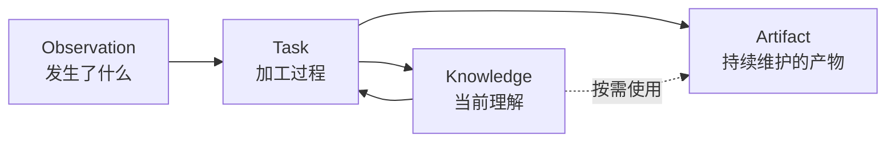

# Observation、Knowledge 与 Artifact

## 为什么要区分三种信息

Agent 活动、形成的理解和用户真正要维护的产物具有不同的修改语义：Observation 需要保真，Knowledge 需要能够修订，Artifact 需要延续用户已经接纳的状态。把三者都当成聊天、向量节点或可重建文档，会丢失出处、覆盖用户编辑，并把运行噪声固化为长期事实。

因此 Oyster 保留三种信息形态，而不是为每种形态建设隔离的系统：

Task 是改变信息的过程，不是第四种信息形态。搜索结果、局部图和工作台是由正式内容形成的界面，不建立平行真相。

## Observation

Observation 可以来自外部 Agent Conversation 或人类指令。人类指令已经确定为可选输入形态，但当前 Knowledge Processing 的结构化选择入口仍只支持 Conversation。发现阶段只保存轻量 catalog，不主动复制全部正文；用户选择一份 Conversation 后，Source Adapter 按稳定身份读取当时的当前内容，并以内容引用标识本次实际使用的版本。

当前 Conversation 输入存在三层表示，它们承担不同职责：

1. 外部来源的原始字节由 `sourceRef` 中的内容 hash 标识，但 Oyster 不保存一份逐字节 source blob；
2. Raw Evidence 是对已读取 UTF-8 内容形成的完整 line model，保留每一行证据正文和稳定的 line/offset locator，但不保留原始换行和字节表示；
3. Canonical Activity 是针对不同 Harness 的确定性阅读投影，排除明确的协议噪声和隐藏推理，并以 Raw Evidence range 指回依据。它用于降低阅读成本，不替代 Raw Evidence。

Adapter 不把不同 Harness 强行压成新的通用 Trace Schema。它只解释 Knowledge/Artifact 策展共同需要的稳定语义：对话、工具调用与结果、状态、附件和无法安全识别的记录；原生 call ID、父子关系与错误状态在来源提供时应保留。分支来源先呈现 active path，再明确标注仍被保留的 alternate/abandoned path，避免把失败探索伪装成最终结论。只有能够证明是 Runtime 或传输噪声的内容才能从阅读投影排除，Raw Evidence 始终保留完整输入。

Knowledge Processing 接受来源后，会把完整 Canonical Activity 写入 `inputs/activity.md`，把归一化 Raw Evidence 写入 `inputs/evidence.txt`，并在必要时保存 `inputs/attachments/`。Host 把它们与 `task.json` 和初始 `TASK.md` 一起创建为 Task-start commit。完成 Task 进入 `main` 后，这些材料继续留在 Repository 历史中，使外部文件移动、变化或消失后仍可读取该 Task 留存的证据视图。Reviewer 只把最新 `main` merge 进 Task branch，不改写既有 Task 历史；Repository 协作服务以原始 Task-start revision 校验 `task.json` 和 `inputs/`。Task 仍不能在外部原件消失后重建原始换行和编码字节并重新计算 `sourceRef`。

外部文件可能移动、变化或消失。系统必须明确暴露来源失效，不能静默替换为相似记录。Catalog 元数据不是用户选择的内容版本；接受时读取到的稳定字节才通过内容引用获得不可变身份。过去使用的 Task 材料是当时加工的记录，但不会自动升级为新的外部来源。

领域设计只关心“实际读取了哪份内容”。准确的读取、变化检测和重新定位算法属于 Adapter 实现，不再创造与内容版本平行的领域身份。

## Knowledge

每个 Statement 是一份以自然语言为主的 Markdown，第一项 H1 作为当前 canonical title，wikilink 表达对其他 Statement 的显式引用。这个最小格式便于用户和 Agent 用普通文件工具维护，也让搜索、反向引用和局部图都能从正文重建。

当前名字表达内容身份，而不是隐藏的稳定 ID。这个选择降低了早期模型复杂度，但意味着重命名与引用迁移仍需后续治理。

可核查出处是 Knowledge 的核心产品承诺。Observation、Task 输入和 Git revision 提供证据留存与变更历史；Maintainer 在 `TASK.md` 中用自然语言记录重要 Knowledge 变更与 Raw Evidence ranges 或输入 Knowledge revision 之间的关系，Reviewer 维护这份记录的清晰性。这一关系和它所解释的内容共处 Git 历史，不需要另建 Knowledge version 到 Evidence 的映射存储。单独的 changed paths、commit 共现或 Git blame 不能替代 Agent 对依据关系的明确说明。

这项能力需要区分四个层次，而不必把它们分别建模成新的领域实体：

- **证据留存**：Task 让与一次加工关联的证据在未来仍可访问；
- **provenance 关系**：`TASK.md` 明确说明变更的直接依据；
- **关系完整性**：Host 确认固定输入没有被改写，locator 仍可解析；当前不对自然语言关系做机器完整性证明；
- **知识核查**：判断来源是否可信、证据是否真的支持结论。

Git 可以承载这些信息的版本边界，但不会自动完成知识核查。关系应表述为“基于”或“派生自”，不能表述为“已证明”。

## Artifact

Artifact 使用普通目录承载任意内容，并通过根 `AGENTS.md` 声明“这是一个需要由 Agent 持续维护的产物”。选择 `AGENTS.md` 是为了复用 Coding Agent 已有的上下文约定，而不是创造 Oyster 专用 manifest。它是维护该 Artifact 的说明；Agent Runtime 的 System Prompt 在信任优先级上更高。MVP 不为潜在冲突增加额外治理层。

Artifact 的当前名字和目录就是身份。目录可以包含二进制、大文件或完整工程；工作台和通用文件浏览器因此只提供尽量通用的阅读入口，不要求统一 Schema。Skill 只是 Artifact 的一种实际用途，其消费约定由对应产品设计说明。

当前产品正式承诺的内容级 provenance 首先面向 Knowledge。经 Knowledge Processing Task 创建或修订的 Artifact，可以通过 Task 与 Git revision 获得文件和变更集级审计；用户、编辑器或 Chat Agent 的其他修改只有普通 Git 历史。任意目录或二进制内部的细粒度出处，需要由其自身格式在有必要时表达，MVP 不为所有 Artifact 强加统一引用 Schema。

## Repository 与协作

三种信息在一个标准 Git Repository 中协作。Knowledge 和 Artifact 是全局正式内容；Task 在独立 branch/worktree 中修改它们，并把证据输入与必要过程摘要放在同一历史中。Task 不保存完整 Knowledge Snapshot，任何时刻的内容都通过 Git revision 读取。Task 与修改共处一段历史只建立 Task 级审计关系，不自动建立 Statement 与证据之间的 provenance 关系。

当前架构有意采用高信任 Agent：普通文件、Shell 和 Git 足以表达维护行为，Agent Runtime 不增加内容路由器、文件类型白名单或复杂审批协议。文档型 Review 反馈适合原地写入，其他内容可以把反馈写入 `TASK.md` 这一统一协作记录。没有留下待处理反馈的 Reviewer 可以继续完成 Repository 集成；这是刻意采用的最小自然语言协议。

当前存储与浏览采用同步文件扫描等简单实现。这是早期规模取舍；只有真实数据证明延迟、内存或写放大不可接受时，才引入索引、分页或增量存储。

## 未确定方向

- Chat Agent 是否迁移到独立 worktree，并由 Agent 负责 merge/rebase；
- Statement 重命名、合并、拆分与 wikilink 迁移；
- 基于 `TASK.md` 自然语言关系的核查体验，以及真实需求是否证明有必要增加结构化索引；
- 长期留存的 Raw Evidence 边界，以及敏感内容、删除和 Repository 传播策略；
- Artifact 的跨设备身份、同步和更复杂的协作治理。

这些方向不引入 Project 概念，也不改变 Observation、Knowledge 与 Artifact 的基本区别。
