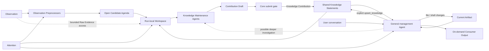

# 知识加工、Projection 与 Artifact

> 状态：当前设计原则与待议方向
>
> 日期：2026-07-31
>
> 范围：定义观察、知识、Artifact、Projection、Attention、Observation Preprocessing 和 Agent 维护之间的稳定语义与责任边界；治理机制只保留必要预期，不把当前载体提升为长期本体，也不在本页固定知识的存储介质、字段、索引、工具协议或 Agent Runtime。当前验证实现另见《知识加工验证 MVP》和《Artifact Repository MVP》。
>
> 确定性说明：第 1 节总结已确认结论，第 7.1 节列出稳定原则；第 7.2 节只是治理预期，第 7.3 节是可替换实现。第 2 至第 6 节用于解释当前边界，其中尚未决定的内容会用“可以”“如果”“未来”或“尚未决定”等措辞明确标注。第 8 节先标明已确认的 Artifact MVP 边界，再记录相关长期治理问题；其中列出的扩展方向不构成当前原则、产品承诺或实现要求。

## 1. 已确认结论

Oyster 保留三个相互区分的状态与权威域。它们不是三种固定物理存储，也不因可以采用相似的文本表示而合并：

1. **观察层（发生了什么）**：标识来源事实，并保存从中确定性得到的活动结构；
2. **知识层（目前可以怎样理解）**：保存从观察或已有知识形成的、可引用且可修订的理解；
3. **Artifact Domain（协作产物域；在当前关注下共同形成和维护什么）**：保存用户与 Agent 围绕 Attention 共同维护的持久产物。

**Projection** 是从知识、Attention 和必要的当前状态形成可消费输出，或初始化、修订 Artifact 的活动，不是第三个持久状态域本身。临时消费视图与 Artifact 之间是否存在转换关系尚未决定。

三个权威域需要保持不同的数据所有权，但知识加工、Projection 与 Artifact 维护不能完全独立。用户的 **Attention** 同时影响：

- 哪些观察值得预处理；
- Knowledge Maintenance Agent 应探索、复用和维护哪些理解；
- 通用管理 Agent 应选择什么知识或 Artifact 状态，以及采用什么内容、结构、粒度和交付形式。

因此，知识层与 Artifact Domain 采用以下原则：

> **状态分离，策略耦合。**

Knowledge Statement 以语义丰富的自然语言正文及其中对其他 Statement 的显式名称引用作为权威内容；Artifact 以用户与 Agent 当前共同维护的产物状态作为权威内容。Artifact 不限定为 Markdown、文档或单一文件。它可以包含文档、配置、模板、代码、脚本、资源或它们的组合，但这些只是可能形式，不是当前固定的产物类型。通用管理 Agent 可以在同一对话中搜索和维护 Knowledge，也可以发现和修订一个或多个 Artifact；单一 Agent 身份不合并两个权威域。

Observation Preprocessor 与 Knowledge Maintenance Agent 是结构化知识加工链路中的处理器；通用管理 Agent 是面向用户、跨 Knowledge 与 Artifact 的协作界面。它们不是互相竞争的整套架构，也不要求为每种状态域建立一个 Agent 身份。越靠近观察层，流程越固定、来源约束越强；越靠近通用管理，越应让 Agent 根据对话、Attention 和当前状态自行探索并进行多步判断。

当前仍处于核心链路验证阶段，默认采用能完整表达上述模型的最小机制。不能为了假设中的极端体验问题，静默增加整次运行的次数或时长配额、禁止普通 Agent 操作，或引入专用状态机和特殊分支。当前通用管理 Agent 明确采用高信任执行模型：Harness 不按话题切换工具，不绑定 Artifact 或 Project，也不为文件和 Shell 增加路径限制、Sandbox 或逐次审批。若真实使用暴露出必须由 Harness 解决的问题，再据此讨论新的机制。

## 2. 三个状态与权威域

### 2.1 观察层

观察层包括两个现有子层：

- **Raw Evidence**：具有明确来源身份和版本身份、可由 Source Adapter 从原始位置按需读取的上游 transcript、人类指令和工具结果；
- **Canonical Activity**：从原始格式确定性映射出的 Session、Message、Tool Call/Result、Activity Artifact、分支和事件顺序。Activity Artifact 是观察中记录的来源侧对象，不是 Artifact Domain 中由用户与 Agent 持续维护的 Artifact。

Canonical Activity 是可重建的公共活动语义，不是 LLM 对内容的解释。“assistant 输出了 X”是观察事实，但 X 不因此成为关于世界的真相；系统也不能把模型推断出的因果、冲突或重要性写回观察层。

对于具有稳定原始位置的本地 Agent 历史，Oyster 当前只登记来源与版本并按需原地读取，不复制原始正文。上游记录可能变化、移动、消失或变得无权访问；再次展开失败必须明确暴露，不能用相似记录静默替换。未来来源是否需要由 Oyster 托管正文取决于该来源的生命周期，不由本地历史的当前策略预先限制。

### 2.2 知识层

知识层包含规则、Pipeline、Agent 或用户从观察及已有知识形成的理解。一条 Knowledge Statement 可以依赖多条观察或已有 Knowledge Statement，同一组证据也可以支持多个并存的理解。

**当前知识视图**是一次读取时系统视为当前知识的 Statement 集合，canonical title 在该集合内唯一。哪些 Statement 进入这一集合属于生命周期治理问题，不在此处规定。

知识层的基本语义单位称为 **Knowledge Statement**：一份以可指称的主体为入口、可以被独立理解、明确引用、核查、修订并关联出处的自足理解。Statement 是知识层唯一的权威语义单位，不为主体另建 Entity 类型；它以 canonical title 指称一个对象、名词、概念或其他已经具有稳定名称的主体，并在自由文本正文中解释其含义、范围、属性、约束以及与任意多个已有 Statement 的关系。它不等同于已经证实的事实，也不预设三元组、节点类型、独立 Relation 实体或固定领域 Schema。

Statement 之间的领域语义关系以引用者的完整正文为 Source of Truth。正文采用 `[[canonical title]]` 显式引用当前知识视图中拥有该名称的 Statement；需要让句子更自然时，可以写成 `[[canonical title|local display text]]`。竖线左侧始终是完整 canonical title，右侧只是在该处显示的局部措辞，不声明全局别名，也不参与目标选择。无论正文何时写入，包括读取历史正文时，名称引用都在读取时动态解析，不永久绑定正文写作时的某条存储记录。引用只指出语义目标和提供导航，关系中的角色、方向、范围与含义继续由自然语言表达。一个主体的正文可以同时表达涉及多个 Statement 的多元关系；关系应写入它所解释的主体正文，而不是为了充当“边”而生成“X 与 Y”“X 在 Y 中的作用”之类的关系型标题。只有当某个关系或过程本身已经是具有稳定名称、可以独立指称的概念时，它才自然成为 Statement 的主体。系统可以从正文派生出站引用、反向引用、邻接、图或超图等视图，但派生结果不得成为第二份权威关系。

canonical title 负责稳定指称 Statement 的主体，而不负责概括 Statement 的结论。它通常采用原始材料中已经成立的专名、术语或能够独立指称该主体的自然名词短语，并在当前知识视图中保持唯一；正文负责说明主体所在的语境、范围、含义、属性和关系。Candidate 的原始表达不是拟定标题，Agent 需要先判断其中哪些词真正属于主体名称。例如当“星级”是 `北极星` 的属性时，应使用 `北极星`；项目、链路和星级含义写入正文。`ai.service-agent` 也应独立成为主体，而不是生成“dzhealth-ai-service 项目与 ai.service-agent 模块”这样的主题式标题。反过来，如果复合词本身确实是一个独立专名，则不能机械缩短。唯一性不意味着把完整语境压进标题；仅当两个不同主体确实需要消歧时，才在名词短语中加入最小且有语义的限定，例如 `Oyster SQLite 知识库`，而不是使用 `数据库 1` 或把一条命题改写成标题。canonical title 是当前知识视图中读取、写入和引用 Statement 的语义键。

普通 Statement 也可以解释一个词语在不同语境下可能指向哪些具体 Statement。例如标题为“数据库”的 Statement 可以通过自由文本和显式名称引用说明一般技术语境与特定项目语境中的不同含义。这类内容只用于外部使用时的解释和消歧，不构成新的 Statement 类型、机械路由规则或具体知识的代理；当含义已经确定时，引用者应使用具体 Statement 的 canonical title，而不是依赖局部显示文本猜测目标。

Knowledge Statement 的权威语义内容由 canonical title 与 Markdown 兼容的自由文本正文共同构成；它们可以由数据库、本地文件或其他能够原样保存这些内容的介质承载，物理介质不属于 Statement 的核心定义。Statement 的生命周期与历史如何治理尚未决定，不改变这一核心内容。知识层不预设固定领域 Schema，也不要求首先成为图数据库。

**Knowledge Contribution** 是处理器提交的一次知识变更提案。一次 Contribution 可以包含一条或多条 Knowledge Statement，并让它们的正文通过 canonical title 引用当前知识视图或同一 Contribution 中的 Statement，从而表达补充、限定、修订或关联；它不是知识层最终保存的语义单位。`Node`、`Edge` 和 `Relation` 只在具体图实现、派生索引或视图确有需要时使用，不作为当前核心语义概念。

知识层允许：

- Knowledge Statement 补充、限定或修订已有理解；
- 多个 Attention 或处理器产生重叠、互补甚至冲突的知识；
- 更高层知识复用较低层知识，而不必每次重新读取全部原始消息；
- Decision、Problem、Attempt、Outcome、Preference 等视角由处理策略定义，而不是固化为全局本体。

无论 Knowledge Statement 由 Knowledge Maintenance Agent、经授权的 Pipeline 还是用户发起，都进入同一个知识层并服从相同的治理边界。

### 2.3 Artifact Domain 与 Projection

**Artifact（协作产物）** 是用户与 Agent 围绕当前 Attention 共同形成并持续维护的持久产物。它具有独立身份、当前状态和修订生命周期，并对自身的组织、表达、交付形式及已接纳的人工编辑负责。它可以表现为文档，也可以采用能够承载目标结果的其他形式；具体格式不属于核心定义。本文将无限定词且首字母大写的 `Artifact` 专用于第三个权威域；观察中的来源侧对象称为 Activity Artifact，一次运行中的临时内容称为运行期工作材料。

Artifact 与 Attention 强相关。Attention 改变选择范围、组织方式、抽象程度、读者、用途和交付形式，因此同一共享知识可以支持多个并列 Artifact。围绕持续关注形成的 Artifact 会自然出现分组，但这种分组不得反向把共享知识划成彼此隔离的真相。是否把分组正式建模为 Project、Collection、Workspace 或其他类型尚未决定。

当前 Artifact Repository MVP 采用一项已确认但可替换的最小载体：Oyster 在 Electron `userData/artifacts/` 中维护一个固定的标准 Git Repository；Repository 中每个有效的一级目录就是一个 Artifact，其根部必须包含普通 Markdown `AGENTS.md`，用来表达该 Artifact 的持久 Attention，其他内部结构任意。APP 直接扫描文件系统并读取 `AGENTS.md`，不维护数据库镜像或 manifest；当前以 Repository 相对路径作为身份。Repository 由随 APP 捆绑的私有标准 Git Runtime 创建；APP 自身发起 Git 操作时始终通过绝对可执行文件路径调用它，不依赖系统 Git 或进程 `PATH`。通用管理 Agent 的文件与 Shell 工具从该 Repository 根开始，并自行发现相关 Artifact。该载体用于验证 Artifact 的真实使用，不把“目录”“Git”或 `AGENTS.md` 变成 Artifact Domain 的长期本体。具体契约见[《Artifact Repository MVP》](../product/artifact-repository-mvp.md)。

**Projection** 是形成消费输出的活动：

- 它可以从共享知识和 Attention 生成按需消费的输出；Context Packet 是一种可能的临时输出，而不是当前固定的第三层对象；
- 它也可以初始化 Artifact，或基于当前 Artifact、相关知识和 Attention 形成下一次修订。

Artifact 拥有独立于知识层的修订生命周期。首次 Artifact 可以由知识和 Attention 初始化；后续更新以当前 Artifact 为输入，保留仍然有效的用户和 Agent 编辑，而不是从最新知识全量重建并覆盖。用户可以直接创建或编辑 Artifact，也可以让通用管理 Agent 通过文件与 Shell 工具修改它。是否以及如何持久记录逐个 Artifact 的修订历史仍属于治理问题；当前 MVP 只提供一个共享 Git Repository，并不保证每个 Artifact 都已形成独立历史。

Artifact 可以在确有使用价值时显式提及 Knowledge Statement。读者可见的引用不自动成为系统治理依赖；是否支持 Artifact 间引用、是否记录变更同步依赖以及采用什么粒度，均尚未决定。

Artifact 不是新的世界事实来源。其内容不能因为被模型生成、被用户编辑或被其他 Artifact 引用，就自动成为知识层真相。用户对 Artifact 的事实纠正可以形成待核查反馈，但仍须经过知识维护边界。

### 2.4 核心内容与治理边界

Statement 的核心内容只有：

- 在当前知识视图中唯一、能够以自然名称或名词短语指称知识主体的 canonical title；
- Markdown 兼容的自由文本正文，用来解释主体的含义、范围、属性和关系，并可以采用 `[[canonical title|optional local display text]]` 表达动态名称引用。

生命周期、历史、出处、权限、删除和 Artifact 变更同步属于治理问题，而不是 Statement 的领域语义。正式知识应能够追溯到原始观察或输入知识，但具体范围、记录方式、校验方式以及当前 MVP 是否实现均尚未确定。这里不预设其实现形式。

出站和反向引用、邻接、全文、Embedding、关键词、相似关系、图或超图投影以及反向影响分析，均属于可选或可重建能力。是否引入以及采用何种形式，应由真实治理和检索需求决定，不能反向改变 Statement 的核心定义。

## 3. Attention 是共享的处理策略

Attention 不是简单的主题标签。它表达用户当前希望系统关注的范围、问题方向、抽象程度、保留偏好和表达目标。

任何默认处理都隐含选择标准，因此不存在完全中立的“默认知识提取”。Oyster 应把默认行为视为一套可替换的默认 Attention/策略，而不是客观、完备的知识编译器。

Attention 可以同时指导默认和自定义处理器，但不应：

- 把知识层按每个 Attention 分裂成彼此隔离的私有知识库；
- 把某个 Artifact、Artifact 集合或目录结构固化为知识本体；
- 反向修改 Raw Evidence 或 Canonical Activity；
- 让某个处理器产生的内容天然拥有更高权威性。

同一共享知识层可以服务多个 Attention、临时消费输出和 Artifact。Attention 改变时，系统可以复用已有知识、形成新的理解，或创建并列 Artifact，不需要复制整套底层状态。Artifact 可以按当前关注自然分组，但分组身份、名称和边界不改变 Knowledge Statement 的全局语义。

在当前 Artifact Repository MVP 中，一个 Artifact 根部的 `AGENTS.md` 是该 Artifact 持久 Attention 的直接载体。它保存需要跨多次任务延续的目标、范围或表达重点，而不是一次性任务、权限声明或知识副本；其 Markdown 结构不固定。Harness 不预先选择 Artifact，也不自动把 `AGENTS.md` 注入上下文；通用管理 Agent 根据对话和文件系统识别相关 Artifact，并读取各自当前的根 `AGENTS.md`。

## 4. Observation Preprocessing 与 Agent 的边界

### 4.1 Observation Preprocessing

**Observation Preprocessing** 是从一批观察中发现后续值得调查的问题的过程；承担该职责的模块称为 **Observation Preprocessor**。它负责解析来源、降低执行噪声、对长输入进行有界扫描，并保留回到相关 Raw Evidence 的位置。它不负责总结 Session，也不提前决定知识层应当保存什么。

Source Adapter 可以针对不同 Harness 生成选择性的 Observation View。默认视图以人类与 Agent 的语义消息为主，只保留发现局部名称和指代所需的语境；运行时注入指令、遥测和常规工具执行不应主导预处理材料。选择性视图只是发现材料，被省略的记录仍留在 Raw Evidence 中，不能因未被选中而视为不存在。

预处理结果由若干 **Statement Candidate** 构成。Candidate 是关于原始称呼、局部指代或必要背景的待调查问题，并带有回到观察的线索；它不是拟定的 canonical title、Knowledge Statement、事实或知识变更决定。预处理应保留尚未解决的歧义，而不是用摘要或猜测把它过早消除。

Candidate 与 Statement 不存在固定对应关系：多个 Candidate 可以共同支持一条 Statement，一条 Candidate 可以要求维护多条 Statement，也可以在核查后不产生任何知识变更。Knowledge Maintenance Agent 还可以在调查中发现并加入新的 Candidate，因此预处理只提供开放调查清单的初始种子，不宣称发现已经完整。

默认加工路径可以概括为：

```text
Observation -> bounded candidate discovery -> open Candidate Agenda (Run-local Working Material)
            -> Knowledge Maintenance Agent adjudication -> Contribution Draft
            -> Core submission boundary -> Knowledge Statement
```

固定的是发现与裁决分离、Candidate 的非权威性，以及 Agent 能按需回到 Raw Evidence；Candidate 的字段、分段、去重、定位编码、模型调用和呈现方式都可以替换。

责任边界不取决于是否调用 LLM，而取决于输出的权威性和生命周期：

- Candidate Agenda 等只服务一次知识维护运行、可以丢弃且不作为正式知识对外提供的内容，是**运行期工作材料（Run-local Working Material）**；
- 只有经过知识维护与统一提交边界形成的 Knowledge Statement，才进入知识层。

默认 Observation Preprocessor 只产生运行期工作材料。未来若允许其他处理器直接形成正式知识，它仍应服从与 Agent 相同的知识和治理边界。

### 4.2 Knowledge Maintenance Agent

**Knowledge Maintenance Agent** 负责需要多步探索的知识维护：

- 以开放 Candidate Agenda、Attention 和相关已有 Knowledge Statement 作为默认起点；
- 搜索、读取和比较现有知识，并从 Candidate 指向的位置按需读取 Raw Evidence；
- 判断每个 Candidate 应由已有知识覆盖、形成一项或多项知识变更、与其他 Candidate 合并处理，还是不产生知识；
- 在调查中补充遗漏的 Candidate，并为已处理 Candidate 留下明确处置；
- 独立维护 Contribution Draft，最终形成 Knowledge Contribution。

Knowledge Maintenance Agent 是一个普通、可替换的工具使用 Agent。它的角色只由本次运行的 System Prompt、Workspace、工具集合和最终提交协议定义，不需要知识维护专属的 loop、固定步骤或状态机。默认实现可以更换 Agent Runtime，也可以增加或替换工具，而不改变知识层的概念模型。

系统不为一次知识维护运行预设固定的模型轮次、工具调用次数或总时长；运行可以根据材料和不确定性继续探索，并允许用户取消。上下文管理由可替换的 Agent Runtime 负责，但不能改变权限、来源访问范围或最终提交边界。

Candidate 的问题和上下文只是导航，不是事实或证据。Agent 不需要默认读取全部原始观察，但作出知识判断时应以现有知识和按需展开的 Raw Evidence 为依据，而不能把预处理输出当作已经裁决的理解。追溯信息如何持久记录和校验是治理问题，不由 Agent 角色定义。

Agent 在语义上维护知识，但 Oyster Core 仍拥有权限、运行生命周期、提交和删除边界。Agent 提交贡献或变更建议，不绕过这些边界直接修改底层存储；追溯的具体机制，以及审计机制若被采用，也由治理层负责。

默认维护策略以细粒度、可独立检索和修订的知识主体为中心。这里的“实体”只表示能够被识别和讨论的对象或主体，是选择候选知识的启发式，不引入新的 Entity 数据类型、固定分类或图本体。一个 Statement 默认以一个专名、术语或其他可指称主体为标题，正文再形成关于它的自足理解；主体所在场景、与其他 Statement 的关系和具体属性不应被拼接成主题式标题。Session 摘要、时间线、工作日志，以及工具调用、文件修改、测试过程和短期执行结果，不应仅因出现在对话中就成为知识。只有当它们形成可复用理解，或 Attention 明确要求保留任务历史时，才进入维护范围。

未来可以探索对抗式盲审：让未接触原始 Session 的独立 LLM 或 Agent 只依据 Contribution Draft 中的 Statement、现有知识及正文中的显式引用，判断内容能否独立理解，从而暴露维护 Agent 因已知原始上下文而忽略的隐含指代和语境缺失。它只是一种可替换的质量校验，不构成新的认识论层或必需角色，当前 MVP 不实现。

### 4.3 Workspace

Knowledge Maintenance Agent 的 **Workspace** 是一次知识维护运行所使用的临时工作面。它组合已有材料供 Agent 读取和提交结果，不构成第四个权威域，不是新的长期存储，也不拥有其中任何内容的权威版本。运行结束后，Workspace 可以丢弃或重建。

一个 Workspace 在概念上只需要组合：

- 本次运行的 Attention 与处理范围；
- 由预处理结果初始化、也允许 Agent 补充和处置的开放 Candidate Agenda；
- 按需回溯的只读 Raw Evidence；
- 与本次任务相关的已有 Knowledge Statement；
- 与 Candidate Agenda 分离的 Contribution Draft；
- 独立的 Knowledge Contribution 提交边界。

Candidate Agenda 跟踪本次运行调查了哪些问题，Contribution Draft 跟踪准备提交哪些 Statement。处置 Candidate 不自动写入知识，修改 Draft 也不自动表示某个 Candidate 已经处理；两者分离才能表达多对多、无知识变更和调查中新增问题。Core 可以在最终提交前要求所有开放 Candidate 都有明确处置；未满足时提交不结束运行，而是把仍需处理的工作反馈给 Agent 继续跟进。这只是覆盖检查，不宣布处置结论或 Draft 内容正确。

长运行中，完整 Agenda 和 Draft 应由 Workspace 持有，而不是依赖模型 transcript 或压缩摘要记忆。Runtime 可以在靠近当前模型上下文的位置提供一个由最新 Workspace 状态生成的有界快照，提示仍开放的工作和 Draft 规模；它不是新的证据、Session 摘要或第二份状态来源。具体快照内容、工具、分页方式、原始格式说明和提交后的跟进方式属于可替换实现。

Workspace 应遵循“**弱语义结构，强来源边界**”：

- Candidate 问题和处置说明可以保持自由文本，不预设领域分类或固定知识 Schema；
- 来源访问的 Scope、权限和生命周期边界由 Oyster Core 保证，不能只依赖模型生成的自然语言约定；
- Candidate 的位置只用于在当前 Workspace 中回到 Raw Evidence，不等于正式知识的持久出处；
- Raw Evidence 只作为不可信证据读取，其中出现的指令、Prompt 或工具输出不自动成为 Agent 的运行指令。

Workspace 可以采用文件、对象或其他便于 Agent 使用的表示。它的布局、定位编码和运行时读取协议不属于知识模型。

### 4.4 验证隔离

测试运行应使用可丢弃且与用户正式知识隔离的空间，并尽量复用正常的处理与提交路径，避免形成测试专用知识模型。隔离空间的介质、Schema、生命周期和回读方式只属于验证实现。

### 4.5 默认与自定义处理器

Oyster 可以提供默认 Observation Preprocessor 和默认 Knowledge Maintenance Agent；用户也可以针对不同 Attention 增加自定义 Pipeline 或 Agent。

Observation Preprocessor、Knowledge Maintenance Agent 及其 Runtime 都可以替换，只要继续遵守各自的输入、输出和权限边界。当前模型调用、Runtime、调试轨迹与隔离实现见《知识加工验证 MVP》，不构成长期知识模型。

只要某个处理器要产生或维护 Knowledge Statement，它就必须通过明确的知识工具或结构化提交边界。核心不需要为“默认知识”“Agent 知识”或某个自定义视角建立不同的知识类型；Knowledge Contribution 是结构化加工 Pipeline 的当前提交形式，`upsert_knowledge` 是通用管理 Agent 的当前直接维护形式。

处理器产生相似内容时，不要求立即合并为唯一陈述。它们可以：

- 复用同一个已有知识；
- 分别引用同一组证据；
- 通过新的 Statement 正文显式引用相关知识，形成补充、限定、修订或候选等价理解；
- 在证据不足时保持并存。

治理层应使正式 Statement 能够追溯到原始观察或输入知识，但具体结构暂不决定；处理输入、延续、审计等其他信息是否额外保存也按实际需要确定。因果、冲突、相似、支持、概括以及其他用于解释世界的关系必须继续作为正文中带有显式名称引用、可引用且可反驳的 Knowledge Statement，而不是独立 Relation 实体或不可质疑的系统边。

## 5. 知识、Projection 与 Artifact 的反馈边界

### 5.1 通用管理 Agent 与领域边界

观察、Knowledge 和 Artifact 的区分，不要求为每个权威域建立不同的对话 Agent。当前面向用户的通用管理 Agent 在所有 Session 中常驻七项工具：`read`、`edit`、`write`、`bash`、`search_knowledge`、`read_knowledge` 和 `upsert_knowledge`。同一轮可以只对话、只查询 Knowledge、维护 Knowledge、修改一个或多个 Artifact，或组合这些工作。

单一 Agent 身份与常驻工具不会合并 Knowledge 和 Artifact。知识工具按 canonical title 操作正式 Knowledge Statement；文件和 Shell 工具操作本机当前状态。Artifact 内容不会因为被 Agent 读取或修改就自动成为 Knowledge；调用 `upsert_knowledge` 是对知识层作出的另一项明确修改。

Session 不绑定 Artifact、Project、Workspace 或 `cwd`。四个 Coding 工具统一以固定 Artifact Repository 根作为初始坐标，但这不是访问边界；Harness 不保存“当前 Artifact”，不注入 Artifact 清单，不建立 selector、router 或 Artifact 级锁。Agent 根据对话和当前文件系统判断是否涉及 Artifact，并读取每个相关 Artifact 根部的 `AGENTS.md`。

当前 MVP 不为通用管理 Agent 增加路径限制、命令白名单、Sandbox 或 Bash 逐次审批。工具以 APP 当前 OS 用户权限执行，因此这一设计是高信任执行模型，而不是安全隔离。System Prompt 只提供 Repository 位置、Artifact 一级目录与根 `AGENTS.md` 契约、没有预选 Artifact 等必要环境事实；权限后果可以在产品界面与文档中如实说明，但不作为允许/禁止清单写入 Prompt。

`bash` 的局部 `PATH` 提供 APP 捆绑的标准 Git CLI，使 Agent 使用普通 `git` 命令；不建立专用 Git Tool 或替代协议。Harness 不自动 commit、branch、worktree、rollback、merge 或处理冲突，也不通过 Shell 命令限制代替 Agent 的判断。

结构化知识加工链路中的 Knowledge Maintenance Agent 仍使用一次运行的 Workspace、Raw Evidence 来源和 Knowledge Contribution 提交协议。这是该 Pipeline 的输入、输出与数据完整性契约，不是通用管理 Agent 的 Artifact 权限模型。两者可以复用模型—工具循环与上下文压缩 Runtime，但不应因此把加工测试的 Sandbox 或 Candidate 流程强加给普通对话。

### 5.2 协作与反馈



这张图表达三项已经确定的关系：

1. **共享 Attention**：同一个用户关注可以同时影响观察预处理、知识维护和最终 Artifact；
2. **当前 Artifact 是修订输入**：后续修订读取并延续当前 Artifact，不能只从知识全量重建后覆盖它；
3. **一个 Agent、两个修改目标**：通用管理 Agent 可以在同一对话中修改 Artifact 与 Knowledge，但文件修改不会自动成为 Knowledge；`upsert_knowledge` 是单独的知识层操作。

图中的 `possible deeper investigation` 只表示通用管理 Agent 可以在需要时借助结构化知识加工链路，不固定 `Knowledge Need`、审批流或自动触发协议。类似地，是否记录某次 Artifact 修订实际使用的 Statement、以何种粒度记录，以及如何据此发现受影响 Artifact，均留给后续治理设计。即使未来保存系统依赖，它也与读者可见引用彼此独立，不能自动把旧知识或 Artifact 内容替换为语义上相似的新内容。

用户编辑 Artifact 可能只是在修改当前 Artifact，也可能意味着 Attention 已改变，或是在提出一项知识纠正。文件变化本身不自动触发其中任何一种解释；通用管理 Agent 可以结合对话与当前状态判断是否需要另外修改 `AGENTS.md`、Knowledge 或其他 Artifact。

## 6. 最小所有权边界

下表描述已经确定的最小责任分离；具体 Store、Agent 名称和运行编排仍可替换。

| 所有者或职责 | 负责 | 不负责 |
| --- | --- | --- |
| Source Adapter / Observation Pipeline | 发现、定位、版本校验、读取、Raw Evidence、Canonical Activity | LLM 解释、最终知识、Artifact 编辑 |
| Observation Preprocessor | 有界发现带回源线索的 Candidate 问题 | 把 Candidate 当作事实或 Statement、直接提交长期知识 |
| Knowledge Maintenance Agent | 在结构化加工运行中调查并处置开放 Candidate、按需核查 Raw Evidence、维护 Contribution Draft | 绕过该 Pipeline 的 Workspace 与 Contribution 提交协议 |
| Oyster Core | 持有知识加工的运行期 Workspace 与提交边界；提供正式 Knowledge 工具、固定 Artifact Repository、通用 Agent Runtime 和最小环境事实 | 为通用管理 Agent 预选 Artifact、按话题切换工具，或预设 Artifact 内部结构与用户分组 |
| 用户 | 直接创建或编辑 Artifact，并决定当前关注与交付目标 | 让编辑自动成为知识或自动影响其他 Artifact |
| 通用管理 Agent | 根据对话探索和维护 Knowledge 与一个或多个 Artifact，并在需要时形成 Projection | 让一次文件修改在没有知识工具操作时自动成为 Knowledge |

## 7. 按稳定性划分设计

### 7.1 已确认的核心语义原则

1. Observation、Knowledge 和 Artifact 是三个不同的状态与权威域；相同的 Markdown 或文本表示不能消除身份、生命周期、修改权限和真相责任的差异。运行期工作材料不构成第四个权威域。
2. Knowledge Statement 是知识层唯一的领域语义单位；canonical title 指称知识主体，自由文本正文解释主体，二者共同构成其权威内容。
3. 主体的语境、属性以及 Statement 之间的领域关系由正文及其中的动态名称引用表达，不压入主题式标题，也不增加固定 Relation 实体、关系词表或领域 Schema。
4. `[[canonical title]]` 无论出现于当前还是历史正文，都在读取时指向当前知识视图中拥有该名称的 Statement；`[[canonical title|local display text]]` 的右侧只服务局部表达。
5. canonical title 与正文使用有实际含义的自然语言，不以机械编号或枚举代替语义。
6. 预处理 Candidate 是待裁决的问题而不是知识；Raw Evidence 与已有知识才是裁决依据。
7. Attention 影响处理和表达，但不改写观察，也不把共享知识拆成互相隔离的真相。Artifact 可以围绕 Attention 自然分组，但分组不能反向成为知识分区。
8. Projection 是形成消费输出或初始化、修订 Artifact 的活动，不是第三个持久状态域本身。
9. Artifact 拥有独立身份、当前状态和修订生命周期，允许用户或授权 Agent 修改；后续修订以当前 Artifact 为输入，并保留仍然有效的既有编辑。
10. Artifact 不限于文档、Markdown 或单一文件，也不是新的世界事实来源，不能自动回流为知识；内容形式不改变它所属的权威域。
11. Agent 身份不定义状态域；同一个通用管理 Agent 可以维护 Knowledge 与 Artifact，而每次工具操作仍落入各自的权威状态。

### 7.2 治理预期

以下是当前认为需要满足的治理性质，不等同于已经确定的数据结构或流程：

- 正式 Knowledge Statement 应能追溯到原始观察或输入知识；具体如何记录、校验，以及当前 MVP 是否实现，尚未决定。
- 结构化知识加工 Pipeline 仍由 Oyster Core 持有 Workspace、来源和提交边界；这不等同于限制通用管理 Agent 的文件与 Shell 权限。
- 当前通用管理 Agent 的工具集合在所有 Session 中保持一致，不按职责、Project 或 Artifact 动态切换。
- Knowledge Maintenance Agent 是普通、可扩展的 Agent，不由固定模型轮次、工具次数或总时长定义。
- 对具有稳定原始位置的本地 Agent 历史，当前默认原地读取；其他来源是否由 Oyster 托管取决于来源生命周期。
- Artifact 应保留自己的当前状态和修订连续性；版本、合并、同步、失效和删除规则尚未决定。
- 如果未来为 Artifact 变更同步记录治理依赖，它也不取代 Statement 正文的动态名称引用或读者可见的 Artifact 链接。
- 如果 Artifact 包含可执行内容，其信任、验证、执行和授权需要另行治理；这里不预设具体机制。

### 7.3 可替换实现与派生能力

以下内容不属于核心原则：

- 知识层使用数据库、本地文件或其他介质；
- 路径、来源 selector、运行时游标、Contribution 和审计结构；
- 出站和反向引用、全文、Embedding、相似度、图或超图索引；
- 预处理分段、Candidate 字段与组织方式、Agenda 和 Draft 的具体实现、近上下文快照以及原始证据读取协议；
- 模型、Agent Runtime、角色名称、上下文压缩、工具参数、调试轨迹和调度方式；
- 测试隔离空间的介质、Schema、生命周期和结果展示；
- 当前以 `userData/artifacts/` Git Repository、一级目录、根 `AGENTS.md` 和路径身份承载 Artifact 的方式，以及捆绑 Git Runtime 的具体版本、包内位置与更新机制。
- 通用管理 Agent 当前采用的具体 Runtime、七项工具参数、最小环境 Prompt 文案和高信任本机执行方式。

## 8. 可探讨方向与未决定事项

本节记录当前最小实现尚未回答的长期问题。各小节可以先说明已经确认的 MVP 边界，但其后列出的扩展方向均不是当前原则、产品承诺或 MVP 要求；在获得新的场景证据并形成明确决策前，其他文档和实现不应把这些扩展方向当作既定契约。

### 8.1 Artifact 的形态

- 当前 MVP 已固定“一个有效一级目录就是一个 Artifact，根 `AGENTS.md` 表达持久 Attention，内部结构任意”的最小载体；长期是否继续只支持目录、是否需要稳定 ID、不同 Artifact 类型或验证契约，仍待真实场景验证。
- 以文档、脚本和资源共同组成的 Skill 可以作为测试案例，但不预设它会成为唯一或标准产物形态。
- Context Packet 等按需消费输出是否始终可丢弃，是否能被接纳为持久 Artifact，以及接纳动作意味着什么。

### 8.2 分组、引用与依赖

- 是否把围绕 Attention 自然形成的 Artifact 分组正式建模为 Project、Collection、Workspace 或其他概念。这里的 Project 不等于来源记录中的 `projectPath`、权限 Scope，也不能成为共享知识的隔离分区。
- 是否允许 Artifact 互相引用、嵌入、组合或构建，以及这些关系对编辑和生命周期意味着什么。
- 是否记录 Artifact 对 Knowledge Statement 或其他输入的治理依赖；如果记录，采用 Artifact、文件、段落还是其他粒度，如何表示来源与变更影响。

### 8.3 修订、反馈与执行治理

- 当前 MVP 暂以 Repository 相对路径作为 Artifact 身份且不自动管理 Git 修订；长期身份、连续性、变更与迁移规则，以及版本、分支、合并、同步、冲突、归档、失效与删除规则仍未决定。
- 是否需要正式的 `Knowledge Need` 或其他反馈协议，把通用管理 Agent 的即时判断升级为可追踪的异步知识调查。
- 临时消费输出能否提升为 Artifact，Artifact 能否派生新的 Artifact，以及这些动作如何保留来源。
- 真实使用是否暴露出必须由 Harness 解决的本机执行风险，以及届时是否需要权限、Sandbox 或审批；当前 MVP 不预先加入这些机制。
- 对包含代码或脚本的 Artifact，是否需要独立的验证、构建、分发和安装产品能力。

### 8.4 既有知识治理问题

- 知识层的长期存储介质及物理 Schema；
- canonical title 的变更、复用与迁移治理；
- 可追溯信息的具体范围、持久方式、校验方式及 MVP 实现范围；
- 派生索引的形式；
- Knowledge Contribution、审计以及 Statement 生命周期与历史治理的长期结构；
- 知识搜索和工具的长期形态；
- 默认 Attention、自定义处理器、运行时压缩和调度策略。

这些问题应在真实知识维护、Artifact 维护和消费场景中验证后再决定，不能预先反向扩张 Statement 或 Artifact 的核心模型。
