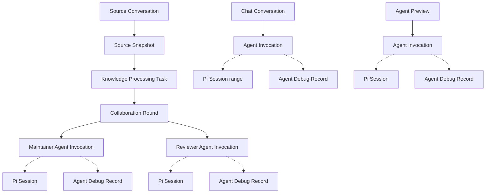

# Oyster 术语与执行模型

> 状态：权威架构词汇表
>
> 日期：2026-08-11
>
> 规则：其他代码与文档必须使用本页术语；若发生冲突，以本页为准。

## 1. 最小概念集合

Oyster 只定义业务上必须拥有独立身份和生命周期的概念，并直接保留 Pi Coding Agent 的基础设施术语。`Run` 和 `Step` 在不同框架中粒度不一致，当前不作为 Oyster 实体；`Trace / Span` 保留给未来真正接入的遥测系统。

- `Chat Conversation`：用户持续对话的产品实体；
- `Knowledge Processing Task`：一次结构化知识加工业务尝试；
- `Agent Invocation`：对一个 Agent Definition 发起的一次执行请求；
- `Pi Session`：Pi 持久化执行历史，保存消息、工具结果、压缩和分支；
- `Agent Debug Record`：本地检查某次 Invocation 内部活动的投影。

其中只有前三项是 Oyster 业务生命周期实体。Pi Session 继续使用 Pi 原生含义；Debug Record 不创造新的执行生命周期。

## 2. 总体关系



虚线表示基础设施引用或调试投影，不表示新的业务所有权。`Discovery Scan`、`UI Milestone`、`Agent Turn`、`Model Call` 和 `Tool Call` 也不是顶层业务实体。

## 3. 权威定义

| 术语 | 精确定义 | ID / 所有者 | 生命周期与持久化 | 不是什么 |
| --- | --- | --- | --- | --- |
| Source Conversation | 外部 Agent Harness 拥有的一条逻辑对话。文件位置可以变化，逻辑身份不随位置变化。 | `sourceConversationId`；Discovery | Catalog 中持久化轻量摘要与当前位置线索；正文仍归外部来源所有。 | 不是 Chat Conversation，也不是一个本地文件的别名。 |
| Source Snapshot | 用户接受的一条 Source Conversation 的精确不可变版本。 | `sourceConversationId + sourceRevision`；消费它的操作 | 被接受前必须重新校验；Task start commit 固定其物化输入。 | 不是“最新对话”，也不是可变 Session。 |
| Knowledge Processing Task | 从一个已接受 Source Snapshot 出发，经 Maintainer / Reviewer 协作形成批准候选 revision 的持续业务工作。 | `taskId`；Knowledge Task Service | `open → completed / abandoned`。Agent 执行失败后仍为 `open`。从创建起在 `task/<taskId>` 的 `tasks/<taskId>/task.json` 中保存。 | 不是一次 Agent Invocation，也不是 UI 操作。 |
| Collaboration Round | Task 中一次 Maintainer 候选交接与紧随其后的 Reviewer 决策组成的业务配对。 | `roundId`、`sequence`；Knowledge Processing Task | 作为 Task 结果的一部分持久化。Reviewer 要求修改后，下一轮使用新的 Maintainer Invocation。 | 不是 Agent Turn，也不是泛化工作流 Step。 |
| Knowledge Agent Definition | 一个稳定逻辑 Agent 的配置与能力定义，例如 Maintainer 或 Reviewer。 | `agentId`；Knowledge Processing Configuration | 配置可持久化；每次执行产生新的 Agent Invocation。 | 不是 Processing Stage，不表示执行顺序。 |
| Agent Invocation | 对一个 Agent Definition 发起的一次独立执行请求；覆盖该 Agent 的模型—工具循环。 | `invocationId`、可选 `parentInvocationId`；发起它的 Task、Chat Conversation 或 Agent Preview | `in_progress → completed / failed / cancelled`。精简记录只保存生命周期、Pi Session 引用、计数与 Debug Record 引用。终态不可继续追加。 | 不是 Task、Pi Session、Model Call 或 Telemetry Span。 |
| Pi Session | Pi Coding Agent 原生的持久化执行历史，包含 message、Tool Result、compaction 和分支关系。 | `sessionId`；Pi `SessionManager` | Chat Conversation 共享一个根 Session；子 Agent 与每次 Knowledge Agent Invocation 使用独立持久化 Session。Invocation 可引用其中的 entry 范围。 | 不是 Oyster Chat Conversation，也不是 Agent Invocation 的别名。 |
| Agent Debug Record | 从一次 Invocation 活动投影出的本地、完整检查记录。 | `debugRecordId`，当前等于 `invocationId`；Local Agent Debug Store | 独立 JSON 保存 Turn、Message、Model Call、Tool Call、Context、最终 Provider payload 与响应信息；未来可按时间清理。 | 不是第二份 transcript、业务历史或 Telemetry Trace。 |
| Agent Turn | Debug Record 内一轮由模型推进、可伴随零个或多个 Tool Call 的活动边界。 | `turnId`、`sequence`；Agent Debug Record | 仅随 Debug Record 保存。 | 不是业务 Round，也不是 Invocation envelope。 |
| Model Call | Agent 执行适配层在模型 StreamFn 边界观察到的一次请求。 | Model Call ID、`sequence`；Agent Debug Record，通常关联一个 Turn | 保存实际 Pi Context、安全生成选项、最终 Provider payload、脱敏 header、响应、输出或错误。Context compaction 也会形成 Model Call。 | 不是 Agent Invocation，也不是独立业务实体。 |
| Tool Call | Agent 对一个工具的一次调用及结果。 | Tool Call ID、`sequence`；Agent Debug Record，通常关联一个 Turn | 输入、结果与错误保存在 Debug Record；Pi Session 同时保存供后续上下文使用的 Tool Result。 | 不是业务 Task。 |
| Chat Conversation | Oyster 内由用户消息、Agent 消息和一个或多个 Agent Invocation 构成的持续对话。 | `conversationId`；Chat Service | 可跨多次用户消息继续；创建时固定模型绑定；完整消息历史使用 Pi Session JSONL。 | 不是 Source Conversation；虽然当前根 Pi Session 与其一一对应，两者仍分属产品和 SDK 边界。 |
| Agent Preview | 用户显式启动的单个知识 Agent 调试入口，用来检查该 Agent 的输入、Invocation 活动和候选输出。 | 由当前预览状态与 Invocation ID 标识；Knowledge Processing UI | 不冒充完整 Knowledge Processing Task，不进入 Task 历史。 | 不是单阶段 Task，不是 Debug Run。 |
| Discovery Scan | 对一个外部 Agent Source 执行的一次有界 catalog 扫描。 | `scanId`；Discovery Service | `queued → in_progress → completed / failed / cancelled / interrupted`；保存轻量进度和结果摘要。 | 不是 Agent Invocation。 |
| UI Milestone | Renderer 从业务状态投影出的进度展示节点。 | 仅 View Model 内的局部 `id`；Renderer | 不单独持久化，不作为恢复或审计事实。 | 不是 Step、Round、Turn 或 Span。 |
| Telemetry Trace / Span | 若未来接入遥测系统，用于跨组件关联和性能观测的遥测实体。 | Telemetry 系统 | 当前未实现；未来也应与领域记录和 Debug Store 分开。 | 不替代 Task、Invocation、Pi Session 或 Debug Record。 |

## 4. 状态规则

- Task 的活动态是 `open`；Agent Invocation 的活动态是 `in_progress`。
- `completed` 表示 Task 或 Invocation 自身的契约已成功完成；子实体成功不等于父实体成功。
- `failed` 和 `cancelled` 是 Agent Invocation 等执行实体的结果，不是 Task 状态。
- `abandoned` 只表示用户明确放弃一个 Task；失败或取消的 Invocation 不会自动触发它。
- Agent Invocation 一旦终态化不可继续执行；其 envelope 不再改变。Pi Session 和 Debug Record 保存已经发生的事实。
- Source Snapshot 被拒绝发生在 Task 接受之前，因此不创建 Task branch 或记录。

## 5. 标识与字段命名

| 实体 | 标准字段 |
| --- | --- |
| Source Conversation | `sourceConversationId`, `providerConversationId` |
| Source Snapshot | `sourceConversationId`, `sourceRevision` |
| Knowledge Processing Task | `taskId` |
| Collaboration Round | `roundId`, `sequence` |
| Knowledge Agent Definition | `agentId` |
| Agent Invocation | `invocationId`, `parentInvocationId` |
| Pi Session | `sessionId`，仅用于 Session 引用或 Pi Adapter |
| Agent Debug Record | `debugRecordId` |
| Agent Turn | `turnId`, `sequence` |
| Model Call | `modelCallId` 或记录自身的 `id` |
| Tool Call | `toolCallId` 或记录自身的 `id` |
| Chat Conversation | `conversationId`, `providerConversationId` |
| Discovery Scan | `scanId` |

代码中不得用无前缀 `runId` 或 `stepId` 表示 Oyster 领域实体。`sessionId` 只表示真实 Pi Session 或第三方原始协议字段，不能代替 Chat Conversation、Task 或 Invocation。

## 6. 文件与存储名称

```text
repository/
├── knowledge/
├── artifacts/
└── tasks/<taskId>/
    ├── BRIEF.md
    ├── PROGRESS.md
    ├── inputs/
    ├── pi-sessions/
    └── task.json
```

- `BRIEF.md`：Task start commit 中的目标、Source Snapshot 引用、Repository 坐标和完成边界；
- `PROGRESS.md`：Maintainer / Reviewer 共用的可变清单与 handoff；
- `pi-sessions/`：该 Task 内各 Knowledge Agent Invocation 的 Pi Session JSONL；
- `task.json`：Host 从 Task 创建起维护的生命周期记录，其中只嵌入精简 Invocation envelope；
- Task branch 使用 `task/<taskId>`。

应用数据目录中的其他执行存储：

```text
<Electron userData>/
├── repository/                     # 用户主 checkout
├── worktrees/<taskId>/             # Task linked checkout
├── agent-runtime/<taskId>/         # Pi runtime-only state
├── chat-conversations/             # Chat descriptor 与 Pi Session JSONL
└── agent-debug/invocations/        # 每个 Invocation 一个 Debug Record JSON
```

Task 从 `task/*` refs 和 `main:tasks/` 读取。旧版 Git 外 Task 记录只读兼容，不再因版本较低而删除。

## 7. 明确允许的边界例外

- Pi SDK Adapter 和 Session 引用中的 `AgentSession`、`SessionManager`、`SessionEntry`、`sessionId`、`getSessionName`、`sessionFile`、`parentSession`；旧 Chat JSONL 兼容读取中的 `JsonlSessionRepo` header metadata；
- Claude、Pi、Codex 原始目录名、JSON 字段或记录类型中的 `session`；
- 旧 Discovery 数据迁移读取的 `sessions`、`runs` 和 `syncedSessionCount`；
- `Agent Runtime` 作为实现分类，以及 npm 命令中的 `npm run`；当前唯一 Agent Runtime 是 Pi Coding Agent SDK，它不是一个生命周期实体；
- 行业研究中引用外部系统原生定义的 Run、Session、Trace 或 Span。

这些例外不能泄漏为 Oyster API、页面文案、CSS/test id 或新的领域类型名。
